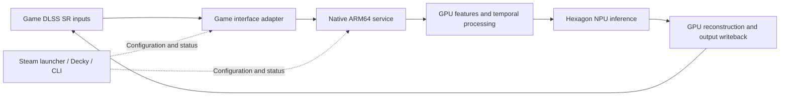

# Decky FSR4 to Hexagon

[中文](README.md) | English

Exploring **FSR4 neural inference on Qualcomm Hexagon NPUs** for Snapdragon Linux handhelds, with Steam integration and an optional Decky management interface.

The first research target is **AYN Odin 3 / Snapdragon 8 Elite / Armada OS**. The proposed pipeline takes inputs from a game's existing DLSS Super Resolution interface, reconstructs the image using the GPU and NPU together, and returns it to the game.

> **Development status: architecture and implementation guides are available; the runtime is not implemented.**
> There is no installable plugin, validated game list, or Odin 3 benchmark from this project yet. This page describes project goals. Upstream experiments do not establish implementation or validation here.

## Project goals

- Use DLSS SR as the input interface in compatible games and execute the main neural-network portion of the FSR4 model on Hexagon.
- Manage models, GPU/NPU cooperation, runtime status, and diagnostics through a shared native service.
- Maintain validated per-game profiles, Steam launch integration, and reversible deployment.
- Offer enable/disable controls and status through an optional Decky panel while retaining an independent CLI.

The NPU handles only part of the algorithm. The GPU still prepares features, handles temporal processing, reconstructs the image, and optionally sharpens it. Any benefit depends on the complete pipeline's quality, latency, power consumption, and compatibility.

## How it would work

The first phase targets one game, one graphics API, and one fixed model profile. Broader game coverage and distribution follow correctness validation.

## Current scope

| Area | Status |
| --- | --- |
| Upstream review, architecture, milestone guides | Initial documentation complete |
| Odin 3 / Armada OS | First research target; no target-device validation by this project yet |
| Game integration | Planned targeted NGX/D3D11 probe; first game not selected |
| FSR4 model | Audited v07/W8A8 path as the initial porting baseline, not every newer FSR4 version |
| Linux QNN/HTP inference and game writeback | Implementation and validation pending |
| Steam launcher and Decky plugin | Planned; no installation package |
| DLSS frame generation and ray reconstruction | Outside the first release |

Having a Hexagon NPU, running a game, or loading a DLL does not establish a working pipeline. Acceptance requires real HTP execution, corresponding-frame output, dynamic image quality, and complete performance evidence.

## Frequently asked questions

**Does this require OptiScaler or ReShade?**

Neither is mandatory. The initial route investigates a dedicated NGX proxy; a Hexagon backend for OptiScaler can be evaluated later. Ordinary ReShade post-processing does not automatically provide the complete temporal inputs required.

**Can I use it by replacing a DLL or setting an environment variable?**

Not currently. A DLL is only an entry point. A native service, compatible QNN/firmware/model assets, and graphics-resource synchronization are also required. A future launcher could automate deployment and configuration for validated games.

**Will it increase frame rate or save power?**

Those are goals to evaluate, not current performance promises. Higher throughput can add latency, and faster NPU inference can be offset by transfers or GPU preprocessing and postprocessing.

**What about games with FSR4 but no DLSS?**

A future adapter could connect the FidelityFX API to the same backend. Feasibility depends on dynamic DLLs, static linkage, and engine integration. This is outside the first prototype's acceptance scope.

## Roadmap and documentation

Work is divided into **M0–M9**, progressing through dependencies and evidence:

1. **M0–M2:** device inventory, real NPU execution, FSR4 model and GPU pipeline port.
2. **M3–M5:** game-interface probe, same-frame end-to-end operation, temporal quality and recovery.
3. **M6:** complete performance, interactive latency, and energy assessment.
4. **M7–M8:** reversible launcher, packaging, and Decky integration.
5. **M9:** additional graphics APIs, games, and input interfaces.

| Document | Purpose |
| --- | --- |
| [Milestone implementation guides](docs/roadmap/README.md) | Implementation steps, interfaces, tests, and acceptance gates for each milestone |
| [AI implementation handoff guide](docs/ai/IMPLEMENTATION_GUIDE.md) | Starting a work package, retaining evidence, and handing work to another developer or AI |
| [Multi-agent workflow](docs/ai/MULTI_AGENT_WORKFLOW.md) | Parallel Sol implementation, focused Astra review, first-batch work cards, and context management |
| [Shared contract draft](docs/architecture/CONTRACTS.md) | Common identifiers, configuration, model, frame, and status semantics |
| [Project status](docs/STATUS.md) | Separate documentation, implementation, and hardware validation |
| [Technical research archive](docs/reference/README.md) | Original Chinese/English feasibility studies, source audits, and pinned references |

The detailed implementation guides are currently written in Chinese. Start with documentation and the device baseline; no executable installation or enablement commands are available in this repository yet.

## Contributing

Contributions are welcome in Linux QNN/FastRPC, Wine/Proton graphics interfaces, FSR4 model porting, temporal quality, performance measurement, and Steam/Decky integration.

Before coding, read [AGENTS.md](AGENTS.md) and the [relevant milestone](docs/roadmap/README.md). Keep each change focused on a verifiable work package and record whether tests ran on a development host, the target device, or a real game. Contributors without the handheld can work on protocols, offline tests, and infrastructure; those results must not be reported as NPU hardware validation.

## Related projects and licensing

This project draws on the following community work. Audited capabilities and revisions are recorded in the [research archive](docs/reference/README.md):

- [fsr4-hexagon](https://github.com/puzzled-pancake/fsr4-hexagon): FSR4/Hexagon game experiments and model-porting research.
- [rp6-npu-unlock](https://github.com/puzzled-pancake/rp6-npu-unlock): NPU enablement research for a specific RP6 platform, not a default Odin 3 installation step.
- [drewano/hexscale](https://github.com/drewano/hexscale) and [54pkp/hexscale](https://github.com/54pkp/hexscale): references for Vulkan integration, QNN services, diagnostics, and management tools.

This repository's license is not yet selected. AMD models, Qualcomm SDK/runtime libraries, firmware, and upstream code retain their respective terms. This repository does not include those proprietary assets and is not an official AMD, Qualcomm, NVIDIA, Valve, or Decky project.
