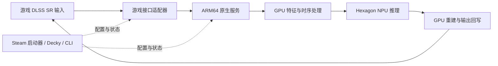

# Decky FSR4 to Hexagon

中文 | [English](README.en.md)

探索在骁龙 Linux 掌机上，使用 **Qualcomm Hexagon NPU 执行 FSR4 神经网络推理**，并通过 Steam 与 Decky 提供易于管理的游戏超分体验。

首个研究目标是 **AYN Odin 3 / Snapdragon 8 Elite / Armada OS**。项目计划从游戏已有的 DLSS Super Resolution 接口取得输入，使用 GPU 与 NPU 协同完成重建，再将结果返回游戏。

> **开发状态：方案与技术路线已建立，运行时尚未实现。**
> 当前没有可安装插件、已验证的游戏列表或 Odin 3 性能数据。本文描述项目目标；上游项目的实验结果不代表本项目已经实现或验证。

## 项目希望实现什么

- 在兼容的游戏中，以 DLSS SR 作为输入接口，使用 FSR4 模型在 Hexagon 上执行主要神经网络计算。
- 通过一个共享的原生服务管理模型、GPU/NPU 协作、运行状态与诊断。
- 为每款游戏保存经过验证的配置，提供 Steam 启动集成和可回滚的部署。
- 通过可选 Decky 面板启用、停用和查看状态，保留独立 CLI。

NPU 只承担算法的一部分。GPU 仍需要进行特征准备、时序处理、重建与可选锐化；最终收益取决于整个处理链的画质、延迟、功耗和兼容性。

## 工作方式

第一阶段计划实现一个游戏、一个图形 API、一个固定模型档位的完整链路。扩大游戏覆盖与通用分发放在正确性验证之后。

## 当前支持范围

| 项目 | 状态 |
| --- | --- |
| 上游源码研究、架构与节点实施文档 | 已完成初版 |
| Odin 3 / Armada OS | 首个研究目标，尚未完成本项目真机验证 |
| 游戏侧接入 | 计划从定向 NGX/D3D11 探针开始，具体游戏待确定 |
| FSR4 模型 | 以已审计的 v07/W8A8 路径为移植起点，不等同于所有新版 FSR4 |
| Linux QNN/HTP 推理与游戏回写 | 待实现、待验证 |
| Steam 启动器与 Decky 插件 | 规划中，无安装包 |
| DLSS 帧生成、光线重建 | 不属于首版范围 |

设备具备 Hexagon、系统能启动游戏、或 DLL 成功加载，都不足以证明这条链路可用。项目以真实 HTP 执行、对应帧输出、动态画质与完整性能记录作为验收依据。

## 常见问题

**需要 OptiScaler 或 ReShade 吗？**

不是必需依赖。首期研究自有 NGX 代理；后续可以评估为 OptiScaler 增加 Hexagon 后端。普通 ReShade 后处理不能自动提供所需的完整时序输入。

**替换 DLL，或设置一个环境变量就能使用吗？**

目前不能。DLL 只是入口，还需要原生服务、兼容的 QNN/固件/模型及图形资源同步。未来启动器可以自动处理已验证游戏的部署和配置，减少手动操作。

**会提高帧率或降低耗电吗？**

这是需要测试的目标，目前没有本项目的性能承诺。更高吞吐可能伴随更大延迟，较快的 NPU 也可能被传输或 GPU 前后处理成本抵消。

**没有 DLSS、只有 FSR4 的游戏呢？**

后续可以研究直接从 FidelityFX API 接入相同后端。是否可行取决于游戏的动态 DLL、静态链接和引擎集成方式，不属于首个原型的验收范围。

## 路线图与文档

完整工作拆为 **M0–M9**，按依赖和证据逐步推进：

1. **M0–M2：** 设备建档、真实 NPU 推理验证、FSR4 模型与 GPU 前后处理移植。
2. **M3–M5：** 游戏接口探针、同帧端到端链路、时序画质与恢复。
3. **M6：** 完整性能、交互延迟和能耗评估。
4. **M7–M8：** 可回滚启动器、打包与 Decky 集成。
5. **M9：** 扩大图形 API、游戏与输入接口覆盖。

| 文档 | 用途 |
| --- | --- |
| [节点技术路线](docs/roadmap/README.md) | 每个节点的实现步骤、接口、测试和验收条件 |
| [AI 编程接续指南](docs/ai/IMPLEMENTATION_GUIDE.md) | 如何开始一个工作包、保存证据并交接给下一位开发者或 AI |
| [跨模块合同草案](docs/architecture/CONTRACTS.md) | 公共标识、配置、模型、帧与状态语义 |
| [项目进度](docs/STATUS.md) | 区分文档完成、代码实现和实机验证 |
| [技术研究留档](docs/reference/README.md) | 原始中英文可行性研究、源码审计与固定版本来源 |

目前从阅读文档和建立设备基线开始；仓库没有可执行的安装或启用命令。

## 参与开发

欢迎协助 Linux QNN/FastRPC、Wine/Proton 图形接口、FSR4 模型移植、时序画质、性能测量以及 Steam/Decky 集成。

开始编码前，请先阅读 [AGENTS.md](AGENTS.md) 和 [对应节点](docs/roadmap/README.md)。每次改动应围绕一个可验证的工作包，清楚记录测试发生在开发主机、目标设备还是实际游戏中。没有掌机也可以贡献协议、离线测试和工程基础，但不能将这些结果标记为 NPU 真机通过。

## 参考项目与许可

本项目参考以下社区工作，具体能力和版本见[研究留档](docs/reference/README.md)：

- [fsr4-hexagon](https://github.com/puzzled-pancake/fsr4-hexagon)：FSR4/Hexagon 游戏实验与模型移植研究。
- [rp6-npu-unlock](https://github.com/puzzled-pancake/rp6-npu-unlock)：特定 RP6 平台的 NPU 启用研究，不是 Odin 3 的默认安装步骤。
- [drewano/hexscale](https://github.com/drewano/hexscale) 与 [54pkp/hexscale](https://github.com/54pkp/hexscale)：Vulkan、QNN 服务、诊断与管理工具参考。

本仓库许可证尚待确定。AMD 模型、Qualcomm SDK/runtime、固件和各上游代码分别遵循自身许可；本仓库不附带这些专有资产，也不代表 AMD、Qualcomm、NVIDIA、Valve 或 Decky 官方项目。
