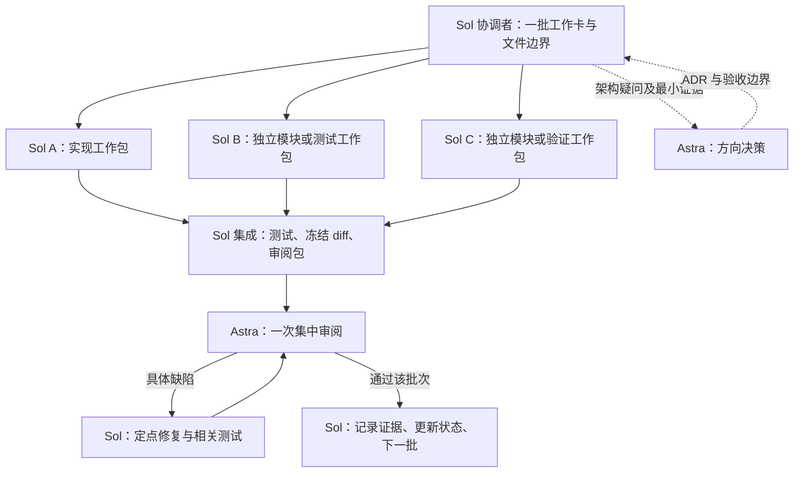

# Sol 开发、Astra 审阅的协作工作流

适用于本仓库的后续开发。配置已写入仓库；首批 M0 主机工具已经完成，M0 真实设备验收及 M1–M9 仍待推进。当前进度以[状态页](../STATUS.md)为准，长期自动续跑使用 [Goal 提示词](GOAL_PROMPT.md)，完整工程要求见[实施指南](IMPLEMENTATION_GUIDE.md)。

## 1. 默认分工

推荐 **1 位 Sol Medium 协调者 + 3 位 Sol Medium 开发者 + 1 位按批次调用的 Astra Medium 审阅者**。三个开发者处理互不重叠的实现、测试或只读验证工作包。若安全可写的工作包不足三个，剩余开发者承担独立的只读验证或兼容性核查，不为凑数量并发修改同一接口。Astra 不需要持续读取所有开发日志，也不需要在每次小修复后重审整个项目。

| 角色 | 默认模型 / 强度 | 职责 | 调用时机 |
| --- | --- | --- | --- |
| 主协调者 / integrator | GPT-5.6 Sol / medium | 拆工作卡、分配文件、汇总证据、集成与更新状态 | 每个批次 |
| `fsr4_worker`，默认三位 | GPT-5.6 Sol / medium | 独立实现、测试或只读验证，短交接 | 每批按不重叠工作包并行 |
| `fsr4_reviewer` | GPT-6 Astra / medium | 审真实 diff、源码与测试，指出正确性问题 | 一个批次集成后；关键修复后复核 |
| `fsr4_architect` | GPT-6 Astra / xhigh | 决定协议、ABI、GPU/NPU 同步和模型路线 | 有具体架构问题时 |

Ultra 留给证据相互矛盾、复杂并发/数值故障等难题，由当前客户端支持的模型设置显式选择，不作为每轮默认。这里的强度是工程起点，并非质量或节省比例保证；实际模型和推理强度要记录在工作卡中。

**多智能体不减少总 token 的必然值。** 它分散上下文，也增加协调与重复读取。目标是减少高成本模型参与常规劳动、限制重复输入、缩短失败循环。Codex 账户额度不能直接按 API 单价推算；未测量前不承诺节省百分比。



## 2. 在 Codex 中如何使用

仓库的 [.codex/config.toml](../../.codex/config.toml) 将主模型和默认子模型设为 Sol medium，子智能体并发上限设为 4（不含主协调者）。工作流本身限制同时开发的 worker 为三个；第四个席位用于在宿主仍保留已完成 worker 线程时启动 Astra reviewer，或按需启动 architect，不代表允许第四个开发 worker。实际可用槽位取配置、客户端和宿主限制中更严格者。

三个独立角色文件位于 [.codex/agents/](../../.codex/agents/)。它们同时声明模型与推理强度，避免 worker 继承主线程的 Astra Ultra。worker、reviewer、architect 都关闭继续分派的能力，协调者负责派工；审阅/架构角色按指令只读，不靠仓库配置更改用户的权限模式。

实际操作：

1. 在这个仓库中开启下一次开发任务，主模型选择 **GPT-5.6 Sol / Medium**。已有任务显式选择的 Astra 不会因写入文件自动切换；换模型也不应被当作清空已有上下文。需要轻量起点时新任务只带工作卡和交接路径。
2. 提示协调者使用 `fsr4_worker` 执行各工作卡，完成后调用 `fsr4_reviewer`。角色文件配置会影响选择了该角色的新子智能体；文件存在本身不会自动启动团队。
3. 若当前宿主没有暴露自定义角色选择，使用可用的原生子智能体工具，给三个开发子任务显式指定 `gpt-5.6-sol` 和 `medium`；审阅显式指定 `gpt-6-astra` 和 `medium`。若工具支持控制历史，采用新上下文/最少历史并传入完整工作卡；不要复制整段聊天。
4. 创建后核对角色/模型信息或启动参数，记录实际执行模型。配置不支持或模型不可用时报告具体原因，不能静默改为 Astra Ultra 再声称使用 Sol。
5. 若宿主无法在子智能体间混用模型，可手动开三个 Sol Medium 任务与一个 Astra Medium 审阅任务，使用独立 worktree 和同样的文件交接。自动新建用户可见任务仍应遵从用户的明确请求，不由工作流擅自扩张。

项目配置只对加载它的会话有效；不受信任的项目可能跳过 `.codex` 层，显式会话设置和宿主限制也会影响结果。不要为使配置生效而修改认证、全局权限或整个用户配置。

可选 CLI 入口（需要本机已安装并登录 Codex；这不是 FSR4 运行时命令）：

```text
codex -m gpt-5.6-sol -c model_reasoning_effort=medium
```

在仓库目录运行，然后输入本页末尾的任务。CLI 与桌面 App 的配置生效情况分别核验。本轮检测到的本地 CLI 为 `0.155.0-alpha.9.2`；未来版本以实际帮助和官方说明为准。

## 3. 一个批次怎样完成

1. **协调者建卡。** 按[工作包模板](../templates/work-package.md)写清目标、基准提交、依赖、读取章节、允许修改的路径、验收、退出条件与报告路径。先冻结三位 worker 共同依赖的最小接口，再并行。
2. **并行执行。** 每位 worker 只处理一个可验证行为，通常涉及少量源码和对应测试。独立模块可以并行；同一接口的生产者/消费者未定约定时先串行。没有独立工作就不多开智能体。
3. **Sol 自检和集成。** worker 跑相关检查，交付短结论及证据路径；协调者检查范围、集成后跑跨模块检查。不能把未集成分支各自通过等同于组合通过。
4. **冻结审阅对象。** 暂停该批次写入，生成[审阅包](../templates/review-packet.md)。提交范围或补丁摘要必须能唯一对应审阅内容；包括新增/未跟踪文件，不只看默认 `git diff`。
5. **Astra 集中审阅。** 读取小包后直接查 diff 和相关源码，关注实质缺陷、必要测试及证据边界。审阅通过只针对这一版本，不代表设备 gate 通过。
6. **Sol 修复。** 把问题转成同一工作包的修复项；跑受影响检查。Astra 复核修复及连带影响，无需重读整份历史。发生新架构问题才转 architect。
7. **唯一集成人收尾。** 更新工作卡、交接、必要 ADR 和 `docs/STATUS.md`；满足全部节点门槛才标节点完成。保留下一批最短输入包。

模板中的审阅结果 `review_verdict=pass/change/blocked` 与运行检查 `gate=not_run/pass/fail/blocked` 是两套语义。Astra 不能把“代码看起来合理”签成 NPU 真机通过。

## 4. 文件所有权与 Git

**同一任务下的原生子智能体可能共享工作目录和 Git 索引。** 不假定自动隔离。协调者分配互不重叠的写入路径，worker 可以读相关源码，但不改对方文件。

- 共享工作区：只有协调者进行 stage、commit、分支切换、merge、push；worker 不操作 Git 索引，不进行全仓库格式化或清理。公共构建入口、合同、schema 与状态页由指定唯一 owner 修改。
- worker 把报告写到自己唯一的 `docs/validation/Mx/<date>-<work-package>*.md`，避免争写一份交接。需要公共接口变化时发出具体提案，协调者安排串行变更。
- 多个用户可见任务：优先为每个 worker 准备独立 `codex/<work-package>` 分支和 worktree，登记共同基准。先确认工作树干净并保存已有工作，再创建隔离环境；不得用 `reset --hard` 或 `git clean` 清现场。
- worktree 允许 worker 提交自己分支，但集成由一人完成。合并后重新验证组合；冲突涉及语义时先解析合同，不盲目选择 ours/theirs。未提交内容不会自动出现在另一 worktree。
- SDK/context 转换、设备测试和 GPU/NPU 压测也有所有权：同一台 Odin 3 同时仅一个硬件操作 owner。不要让两个 agent 同时安装、占用 DSP 或测功耗。

## 5. 控制上下文与失败循环

协调者持有路线与当前状态，worker 持有自己工作卡，Astra 持有审阅包。长期事实保存在文件和 Git，聊天用来派工和报告差异。

| 输入 / 输出 | 建议范围 | 需要补充时 |
| --- | --- | --- |
| worker 起始输入 | AGENTS、工作卡、相关合同/节点小节、必要源码 | 用 `rg` 定位再读相邻实现 |
| worker 最终回复 | 约 300–600 中文字，文件/检查/缺项/下一步 | 完整日志和报告留文件 |
| Astra 审阅包 | 一份短摘要、精确 diff、证据链接与待决策问题 | 按缺陷直接追踪源码 |
| 新会话交接 | 当前提交、工作卡、最后报告、未解决问题 | 不粘贴上轮聊天全文 |

以上是软目标，不因长度限制删掉必要的正确性证据。不要给每位 worker 都塞中英文 README、十份节点指南和完整上游研究；不要每轮重复所有文件或让所有 agent 各做一次同样的调研。

同一问题连续两次针对性尝试仍无新证据时，先整理“复现、已排除假设、最小待决策点”，由协调者决定最小实验或升级 Astra；不是让用户重新批准普通修复，也不是再开三位 agent 重复尝试。等待委派结果使用事件等待，不忙轮询；无新信息不生成长总结。

每批记录实际模型、强度、子任务数、重试/返工次数、耗时及平台实际提供的 usage。usage 不可见就填 `unknown`，不要按字数猜 token；也不要把账户总体额度变化都归因于本项目。跑过两三批后再比较质量、返工和实际费用/额度，调整并发与强度。

## 6. 哪些情况要让 Astra 介入

- 首次确定或修改 PE/ELF ABI、帧协议、reset/消费确认、GPU/NPU 生命周期。
- 模型量化误差、时序画质或同步问题出现相互矛盾证据。
- 准备把某个设备/游戏组合标为通过、默认推荐或发布时，复核证据是否足够。
- 同一最小问题在两轮针对性修复后仍无进展。

一般文件采集、参数解析、fixture、已定接口的实现与普通测试由 Sol 完成。仅格式或链接修正可以由 Sol 检查并记录；不要给每个琐碎改动都安排 Astra。架构审阅是团队内的质量步骤，不自动增加用户确认流程。

## 7. 可直接使用的 Goal 提示

复制 [GOAL_PROMPT.md](GOAL_PROMPT.md) 中的完整提示启动 Goal。它会从 `docs/STATUS.md`、当前提交和最新证据恢复进度，不会重跑已经完成的 `FIRST_BATCH`。

模型名写进普通提示词不会自行切换模型；协调者必须通过宿主支持的模型参数/角色实际创建，或由用户在客户端选择对应模型。

## 8. 配置依据与验证边界

2026-09-20 核对的 [OpenAI 子智能体文档](https://learn.chatgpt.com/docs/agent-configuration/subagents)说明了项目角色 TOML 和模型/强度设置；[配置参考](https://learn.chatgpt.com/docs/config-file/config-reference)说明了默认子模型、并发上限及项目层约束。具体额度、上下文和可用强度以当前账户与客户端为准，不把 [API 模型页](https://developers.openai.com/api/docs/models/gpt-5.6-sol)的规格当成 Codex 任务保证。

首批 M0 实际使用两位 Sol Medium worker 并完成 Astra 定点复审，这是当时配置下的历史证据。后续配置现为三位 Sol Medium worker 与 Astra Medium reviewer；需要在重新加载本项目的新任务中核对宿主是否采用角色和强度。语法/本地配置检查不等于已经完成一次使用新组合的运行时开发验收。
