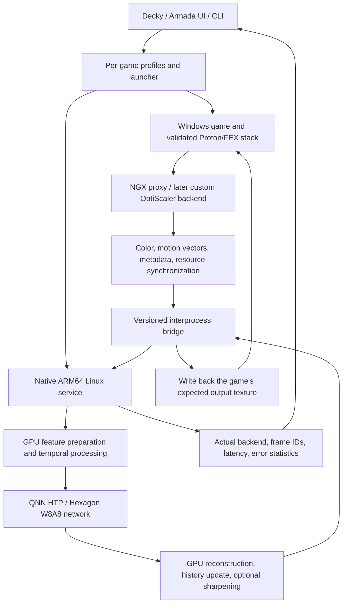

> **Technical research archive · 2026-09-20**
> Preserved from commit [`4bd72a7`](https://github.com/54pkp/Decky-FSR4-to-Hexagon/commit/4bd72a710d2f07ffeb765bb5363f5ba64714d320). For current implementation plans and status, see the [roadmap](../roadmap/README.md) and [status page](../STATUS.md).

# Decky FSR4 to Hexagon

[中文](2026-09-20-feasibility.zh-CN.md) | English

A research and implementation plan for **AYN Odin 3 / Snapdragon 8 Elite / ARM64 Linux**: intercept a game's DLSS Super Resolution calls, execute the neural-network portion of FSR4 on the Hexagon NPU, and write the reconstructed result back to the game's output texture. The intended user interface combines Steam launch integration with a Decky-style management panel.

**Status: research plan. This project does not yet provide an installable plugin, runtime, or target-device validation results.** This work covers source auditing and architecture planning; no tests were run on an Odin 3. Architecture, commands, interfaces, and milestones marked “proposed” below are not delivered features.

Research date: **2026-09-20**. The user specified an Odin 3 with Snapdragon 8 Elite and entered the operating system as “Amrda OS”; this document provisionally interprets that as **Armada OS**. The exact image, kernel, Steam/Proton versions, and first game still need verification. The official device table identifies Odin 3 as SM8750; its device tree also contains a CQ8725S identifier. Device support does not establish that QNN or FSR4 already works. [S5][S5a]

## 1. Answers about integration

| Question | Conclusion |
| --- | --- |
| Is OptiScaler required? | **No.** `fsr4-hexagon` implements its own NGX proxy. OptiScaler could provide a broader game-input adapter later, but stock OptiScaler does not include the Hexagon FSR4 backend needed here. A new backend or bridge would be required. |
| Is ReShade required? | **No, and it is not the recommended primary route.** The final image available to ordinary post-processing is insufficient for a general replacement of an engine's temporal upscaling interface. A purpose-built ReShade add-on could participate, but inputs, synchronization, and the NPU service would still need implementation; an FX shader alone cannot provide them. [S6] |
| Is replacing each game's DLL enough? | **A DLL is one entry point, not the complete system.** Correct DLL loading, any required GPU/NVAPI capability adaptation, a native service, QNN/firmware/models, resource formats, and synchronization are also needed. Upstream is not a universal distribution that works by replacing one `nvngx_dlss.dll`. |
| Can one environment variable enable it globally? | **A unified switch is possible, but a variable cannot create missing support.** Our launcher/runtime must implement and read it. DLL search paths, game APIs, Proton prefixes, and model shapes still require per-game handling. Enable it only for validated games. |
| Can it become a Decky plugin? | **Yes; this is the recommended final management interface.** Decky manages installation, game configuration, services, and diagnostics. Native components handle frequent image processing. Keep a CLI/launcher so Decky or Steam UI changes do not block the functionality. |
| Does “moving FSR4 to the NPU” eliminate GPU upscaling work? | **No.** The first version should retain a hybrid pipeline: GPU feature preparation, temporal reprojection, history handling, reconstruction/sharpening; NPU execution of the adapted W8A8 network; and CPU control plus any necessary copies. |

“Spoofing” here means exposing the upscaling interface and capability information the game expects. It does not mean emulating every NVIDIA GPU feature. The research scope is **DLSS SR inputs → the FSR4 model path**. DLSS Frame Generation, Ray Reconstruction, Reflex, and full NVIDIA extension coverage are outside the first release. The game itself must already run on the device's graphics and compatibility stack.

**Recommended route: establish NPU availability on Odin 3, then connect one auditable NGX proxy and one game; evaluate an OptiScaler backend extension afterward; package the launcher and Decky interface last.**

## 2. What the four projects actually provide

The following SHAs matched the remote HEADs on the research date. Existing source, author-reported results, and this project's plans are distinct kinds of evidence.

| Project and audited revision | Existing capabilities | Role and limitations for this project |
| --- | --- | --- |
| [`puzzled-pancake/fsr4-hexagon`](https://github.com/puzzled-pancake/fsr4-hexagon/tree/8c7a972ab70e5693828a856da71ce711232af463) `8c7a972` | NGX proxy, game-texture readback, TCP, Android ARM64 daemon, GPU preprocessing/postprocessing, QNN FSR4 network, output writeback | Main reference for the algorithm and game-integration prototype. It is an RP6/Android/Wine/Box64/DXVK experiment, not a general Linux SDK. |
| [`puzzled-pancake/rp6-npu-unlock`](https://github.com/puzzled-pancake/rp6-npu-unlock/tree/31c701d8b0a95cde4398b6af6929cdcf75eb83e8) `31c701d` | Research into CDSP/FastRPC enablement for specific RP6 Android firmware, with device-tree and module patches | A diagnostic reference. **It is not an installation dependency for Odin 3/Armada, and its flashing scripts should not be ported.** |
| [`drewano/hexscale`](https://github.com/drewano/hexscale/tree/29dc6a67c764513b3e85beb9cf548bce133a1899) `29dc6a6` | Vulkan present layer, GPU CAS, CLI, IPC, service, Decky framework, NPU asset preparation | Useful surrounding infrastructure. QNN execution still contains placeholders at this revision; it is not evidence of working NPU upscaling. |
| [`54pkp/hexscale`](https://github.com/54pkp/hexscale/tree/8fed58387dcd5b417910b71f15b12d3aa1e509fa) `8fed583` | Real QNN provider/graphExecute, frame IPC, Vulkan readback/upload, tiled XLSR processing, ARM64 packaging, development validation | Prefer its service, diagnostics, and packaging experience. **It is not FSR4** and has not been tested on Odin 3/Armada hardware. XLSR and offline ANVIL are not substitutes for FSR4 temporal reconstruction. |

### 2.1 `fsr4-hexagon`: an end-to-end prototype with important limits

The main implemented path is **D3D11 NGX Create/Evaluate → staging textures → TCP → live_daemon → QNN + GLES → D3D11 UpdateSubresource**, starting in `proxy/full_proxy.c`. It is more than offline ONNX inference. However, D3D12 Create/Evaluate return unsupported, and there is no equivalent Vulkan implementation. `injector/d3d12_inject.c` performs registry injection for a particular game; its filename does not establish D3D12 rendering support. [S1a][S1b]

Upstream `docs/REPRODUCING.md` asks for DX12 in the game, which conflicts with the D3D11 implementation above and needs clarification through reproduction. Its Quality-mode instructions also do not map directly to the proxy's size queries. Record actual NGX entry-point logs, texture dimensions, mode, and game build rather than relying on menu labels. [S1a][S1c]

The algorithm is pinned to **fsr4 v07 from FidelityFX SDK 2.0.0**, reconstructed/repartitioned into W8A8, with work such as the first convolution retained on the GPU. Upstream uses QAIRT 2.50 and HTP v73, with different model builds for 1080p and 720p shapes. It does not automatically run the latest FSR4 DLL on any Hexagon. The current AMD FSR SDK differs from this research snapshot; avoid upgrading both model and platform during the first port. [S1d][S10]

`live_daemon.c` and `qnn_service.c` are the relevant implemented paths. Some comments in `fsr4_service.h` still describe an older contract with static history and single-threaded execution; the production split path updates history/recurrent state. The service API has implementations in the `.c` files, but the build script links them into an Android executable, not an installable general Linux SDK. [S1e]

Game-input semantics also need work: the current proxy defines a depth key without consuming it, does not pass NGX reset through the live path, and does not fully forward the game's exposure parameters. History reset primarily relies on motion thresholds. Upstream can also fall back to bilinear output or redisplay cached frames. A visible image therefore does not prove that each frame came from the NPU: count real HTP executions, fresh outputs, and cached redisplays separately. [S1a][S1e]

For one game on RP6, the author reports 1080p output at minimum settings improving from 29.5 to 36.1 FPS, while power rises from 9.4 to 11.5 W and energy per frame stays approximately unchanged. These are neither this project's measurements nor a prediction for Odin 3. The author describes approximately **four frames of accumulated image age, or 133 ms at 30 FPS**, from asynchronous queues. This is an architectural estimate, not measured input latency. Agreement between W8A8 and a reference INT8 graph also does not establish dynamic image-quality equivalence to original FP16 FSR4. [S1f]

### 2.2 The two `hexscale` versions: infrastructure and algorithms are separate

In upstream `qnn_backend.cpp`, `load_context_binary` mainly reads a file, and `execute_dmabuf` does not yet execute real inference. The visibly implemented present path is fragment-shader CAS. NPU labels, interface names, and success return values are insufficient evidence of model execution. [S3]

Your fork actually calls QNN in `qnn_runtime.cpp`. Its `frame_processor.cpp` preprocesses, tiles, and postprocesses a **single-frame RGB spatial model**. XLSR maps 128×128 to 512×512 and is then resampled to the requested size. The present layer preserves the swapchain dimensions. It does not automatically lower the game's internal render resolution or acquire general engine motion vectors, jitter, exposure, and reset semantics. [S4a][S4b]

Replacing the XLSR context file with an FSR4 context is therefore insufficient: tensor channels, quantization, history state, and GPU preprocessing/postprocessing differ. The separate ANVIL interpolation work is also outside the functionality required here. Existing Windows QNN CPU/Vulkan tests demonstrate parts of the implementation; cross-compiling AArch64 ELF files and generating a v79 context offline do not constitute HTP device testing. [S4c]

The existing Decky panel primarily controls the daemon. It does not provide this project's per-game proxy deployment or Steam launch management. The fork's sharpness/profile values likewise do not demonstrate active GPU sharpening or HTP power settings. [S4c]

### 2.3 Check existing Odin 3 platform support first

Current Armada source enables the Odin 3 CDSP node, supplies matching firmware, and enables FastRPC in the kernel configuration. The first step is to check **whether the user's installed version contains and successfully runs those components**, rather than starting with an “unlock.” Source configuration does not prove successful firmware loading, correct user permissions, or compatibility between QNN runtime and kernel ABI. [S5a][S5b]

`rp6-npu-unlock` targets specific Android 13 firmware on RP6. Its README explicitly says the successful boot record also used module patches; the device-tree-overlay-only path was not independently validated. These findings cannot be generalized into SM8750 Linux instructions. [S2]

## 3. Target architecture and component responsibilities (proposed)



Initially, GPU processing runs in the service's separate graphics context to simplify porting the upstream algorithm. Move it into the game process or a Vulkan bridge later only if doing so demonstrably reduces copies between contexts. The NPU daemon remains a native ARM64 Linux program; it does not load Android QNN libraries inside an x86 translation environment.

| Component | Responsibilities | Explicitly outside the first version |
| --- | --- | --- |
| Game adapter | NGX initialization/capabilities/create/evaluate/destroy, accurate input mapping, output writeback for each API | Full GPU emulation, frame generation, ray reconstruction |
| `fsr4hex-daemon` (proposed name) | Session management, model validation, GPU/NPU scheduling, history state, statistics | Scanning and modifying every game or bypassing system-driver restrictions |
| `fsr4hex-run` / CLI (proposed) | Select AppID profile, preflight checks, load proxy, start service, restore changes on exit | Enabling unknown games through environment variables alone |
| Decky frontend/backend (proposed) | Health status, per-game switches, model presets, diagnostics, rollback | Moving or inferring every frame in Python/JS |
| Optional Vulkan layer (later) | Resource interoperability at explicitly identified points, diagnostics, or spatial mode | Automatically recovering all temporal inputs by intercepting present alone |

## 4. Integration choices: one complete path before broader coverage

### Route A: a targeted NGX proxy for the first phase

1. Pin a game and graphics API with existing DLSS SR, no anti-cheat interference, and confirmed device compatibility. Begin with an entry point covered by the upstream D3D11 proxy.
2. Reuse verified NGX protocol knowledge to implement capability queries, dimensions/mode selection, Create/Evaluate/Release, and error propagation.
3. Configure DXGI/NVAPI capability adaptation where needed to make the game call the proxy. This enables the entry point; it does not perform NPU inference.
4. Demonstrate the full path using actual Evaluate counts, NPU execution counts, and output-texture markers.

**DLL names must follow the particular game's loading path.** `nvngx.dll`, `nvngx_dlss.dll`, and `dxgi.dll` occupy different positions and are not interchangeable. Upstream's `nvngx.dll`, `nvapi64.dll`, registry injector, and `dxvk.conf` form its specific combination, not a universal installation checklist. Do not let OptiScaler and a custom proxy compete for the same entry point in the first version.

### Route B: extend OptiScaler with a Hexagon backend for broader coverage

OptiScaler already handles multiple input APIs, game differences, and output backends, making it a reasonable long-term adapter candidate. [S7] It would need an explicit `FSR4-Hexagon` backend that sends normalized inputs to our service. Selecting its existing AMD GPU FSR4 output would not move execution to the NPU.

Work includes resource-state/queue handling, model capability reporting, errors/fallbacks, separate D3D11/D3D12/Vulkan validation, and checking GPL-3.0 requirements against the planned distribution of new code. Maintain this larger fork only after Route A and the platform gates pass; prefer upstream contributions where possible to reduce the patch burden.

### Route C: a unified launcher / Proton integration for distribution

Store versioned runtimes centrally and install the minimum proxy/configuration per game, retaining hashes, backups, and restoration records. Then evaluate launch-time deployment, temporary mappings, or a compatibility-tool wrapper so users need not copy DLLs manually. These reduce user effort; they do not remove per-game integration differences.

`LD_PRELOAD` is not a general replacement mechanism for Windows PE DLLs. `WINEDLLOVERRIDES` affects the corresponding Wine loading chain only. Verify paths and environment inheritance across the Steam container, RootFS, FEX thunks, and Proton individually.

## 5. Key engineering work for Linux ARM

### 5.1 Architecture, drivers, and QNN

Do not treat ARM64 Linux, Android ARM64, and ARM64EC Windows DLLs as the same ABI.

- The service needs **AArch64 Linux QNN/QAIRT** runtime libraries matching the system libc/loader, FastRPC userspace libraries, and the correct HTP Stub/Skel. Android bionic `.so` files cannot directly replace glibc libraries. [S11]
- Prepare Odin 3 as the **SM8750 platform family / expected HTP v79**; the actual device may identify itself as CQ8725S. Verify the QNN SoC enumeration against the SDK/device; it is not the Linux SoC ID. This plan regenerates contexts for v79 rather than assuming compatibility with RP6's v73 contexts. The fork's offline XLSR context with `socModel=69` and `dspArch=79` is only a toolchain reference; FSR4 needs a separate conversion. [S4d][S5a]
- Pin each context to the model hash, QAIRT version, SoC/HTP, tensor shapes, precision, and quantization parameters. File extensions do not establish compatibility between combinations.
- Official Proton now documents ARM64 builds, so a blanket “ARM64 is unsupported” claim is incorrect. It also explicitly states that an ARM64 build cannot be used with x86 Steam running through FEX. Preserve Armada's configured Steam/Proton/FEX combination as the initial baseline. [S8]
- A traditional x86-64 Wine/Proton stack generally needs an x64 PE proxy. ARM64/ARM64EC mixed stacks require verification of the actual DLL ABI and loading strategy. Do not rebuild every DLL as ARM64 or assume one x64 DLL covers every combination.
- Load Vulkan layers at the correct guest/host boundary: x86 ELF and AArch64 ELF layers are not directly interchangeable. FEX graphics-library forwarding does not establish automatic compatibility for a new layer, extension, or handle. [S9]
- Run the inference service as the ordinary desktop user. Requirements for FastRPC dynamic PD, a listener, or `cdsprpcd` depend on the BSP/runtime; do not make one process name a universal device requirement. [S11]

### 5.2 GPU preprocessing/postprocessing and NPU tensors

First preserve computation order and quantization definitions, and reproduce the algorithm with offline inputs on Linux EGL/GLES. Remove Android NDK, `libandroid`, and AHardwareBuffer dependencies. **Upstream's bridge using AHardwareBuffer/gralloc and Android EGL extensions is an Android-specific path.** EGLImage itself is not Android-exclusive and can remain on Linux, but memory allocation, import, and synchronization must be replaced and verified. Copying the implementation does not establish Linux zero-copy support. Port GLES compute to Vulkan compute if necessary, comparing outputs stage by stage with the reference.

Use two explicitly named modes:

| Mode | Purpose | Limitation |
| --- | --- | --- |
| `research-compatible` (proposed) | Reproduce upstream model, color handling, history, and asynchronous behavior closely enough to isolate porting differences | Reproducing the author's implementation does not establish equivalence to every official FSR4 path |
| `temporal-correct` (proposed) | Correct current-frame semantics, game inputs, and complete history lifecycles for a product candidate | Requires fresh image-quality and performance validation; upstream scores do not carry over |

The suggested first fixed preset is **960×540 → 1920×1080** for comparability. If resources or latency make it unsuitable, build a separate **640×360 → 1280×720** preset. Explain display scaling separately when showing 720p output on a 1080p panel. Other ratios, DRS, HDR, and ultrawide resolutions do not become supported merely by changing output dimensions.

Detailed M2 sequence (development steps, not yet executed on Odin 3):

1. Pin the source, license, and hash of `fsr4_model_v07_i8_quality` from an SDK obtained legitimately by the user. Generate weights and graph descriptions with `model/extract/build_weights.py`, and run the simulator checks first.
2. Build the reference graph following `model/onnx/`, then check whether upstream workarounds such as clip-free Q/DQ and dummy outputs are still necessary with the chosen QAIRT/v79 combination. Do not remove operators blindly.
3. In a pinned tool environment, perform ONNX → DLC → W8A8 quantization. Save the calibration-input manifest, encodings, and per-tensor scale/offset values. FSR upstream uses QAIRT 2.50 while the fork uses 2.45; record them separately rather than mixing headers, tools, and runtimes and assuming compatibility.
4. Generate a context for the actual SoC/HTP and fixed resolution, then check its graph name, layouts, and output count. Upstream's 1080p NPU interface is INT8 NHWC `[1,540,960,16]` → `[1,1080,1920,8]`, not ordinary three-channel RGB. Actual graph metadata is authoritative. [S1d][S1e]
5. Validate weights/ONNX references, QNN graph outputs, GPU features/reconstruction, and continuous-frame final outputs in sequence. Report maximum/mean errors and dynamic image quality. GPU features and INT8 encodings form one contract; checking only the final RGB image is insufficient.
6. Save a model manifest covering source version, conversion-script SHA, QAIRT, SoC/HTP, input/output shapes/types/quantization, graph name, shader hashes, and test reports. Preset changes or upgrades require the entire manifest to match again.

### 5.3 Frame protocol and temporal semantics (proposed v1)

Separate control and frame protocols. Start with a **synchronous correctness baseline: one request, returning the result for that same frame**. Optimize throughput afterward.

| Data | What must be recorded or validated |
| --- | --- |
| Session and version | Protocol version, session/context ID, model hash, feature bits, error codes |
| Frame identity | Frame ID, input/output dimensions, timestamps, history generation; reject responses from another session or stale responses |
| Texture description | Format, color space, row pitch, stride, length, valid region, input/output capacity |
| Temporal inputs | Color, motion vectors with units/direction/scale, jitter, reset, exposure/pre-exposure; handle depth, reversed depth, and optional masks according to the input API and algorithm |
| Synchronization | Boundaries for readable input, NPU completion, output writeback, and game reuse; explicit resource lifetimes |
| Capability limits | Fixed model shapes/formats, session count, timeouts, maximum messages; reject unsupported cases or choose a validated fallback |

The upstream live experiment's input path is not the full FidelityFX input contract. Preserve semantics such as NGX-provided depth, and state which inputs the algorithm uses and which remain unused. Do not assume a depth or motion texture is correct without a validated mapping.

Maintain independent history/recurrent state for every upscaling context. Scene cuts, explicit resets, size changes, model switches, disconnect/reconnect, pause/resume, and discontinuous frames need testable reset policies. Use translation patterns to verify motion-vector direction, units, and Y-axis orientation. Jitter and exposure must not remain hardcoded.

Upstream improves throughput with a multi-frame pipeline, but **returning frame n-k from Evaluate(n) can misalign the image with the game's current HUD, postprocessing, and history**. Do not present that behavior as a low-latency default. Asynchronous modes need explicit frame-age/history-advance rules and interactive-latency validation.

D3D12 extensions must also handle command-submission timing: the game may not yet have submitted the command list passed to Evaluate. Do not wait inside the callback for a fence associated with that unsubmitted work, or unilaterally close or submit the game's command list. Establish a submission-interception or interoperability design with a standalone sample first. D3D11's staging/Map path cannot simply be carried over to D3D12. This engineering constraint follows from D3D12's explicit submission and synchronization model. [S12]

### 5.4 Prove transport optimizations in stages

1. **Copy baseline:** game GPU readback → loopback TCP → ARM64 service → response → GPU upload. TCP is an easier first bridge than Unix FD passing across Wine. Bind locally, use session credentials, and bound message sizes and timeouts. The control plane can use a Unix socket.
2. **Shared memory:** evaluate memfd/tmpfs ring buffers on the native side. The PE side needs an explicit Wine Unix bridge or mapping mechanism; do not assume WinSock can send `SCM_RIGHTS`. Do not use ordinary disk files for frequent full-frame writes.
3. **GPU ↔ NPU shared memory:** separately verify Vulkan external memory, DMA-BUF/allocators, QNN registration types, cache coherency, layout/stride, and fences. Exporting an FD does not establish that HTP can register it or read current data.
4. **End-to-end interoperability:** even after internal service sharing works, resource export through D3D→DXVK/vkd3d→Wine/FEX→host remains a separate problem. Describe measured copy counts and latency rather than promising zero-copy in advance.

For capacity planning, upstream's raw 1080p wire payload is approximately 2.07 MB of color + 4.15 MB of motion vectors + 8.29 MB of RGBA8 output per frame: **14.52 MB total, or about 435 MB/s at 30 FPS**, counting logical traffic in both directions. This excludes GPU/CPU staging, NPU tensors, and additional copies; it is not measured DRAM bandwidth. Reducing graphExecute time alone therefore cannot guarantee a benefit. RGBA8 output also cannot preserve full HDR precision. [S1a]

Fallbacks must preserve API semantics. Report unsupported before creation when unavailable. During execution, switch only to an implemented output path valid for the same frame, or disable the feature and request a restart where necessary. Do not return a low-resolution source directly as a high-resolution output, wait indefinitely, pass an old frame off as success, or silently execute on the CPU while reporting NPU operation.

## 6. Intended Steam / Decky experience (proposed)

1. Install the ARM64 user service, CLI, adapter package, and optional Decky plugin once. Users prepare models and proprietary libraries according to their respective licenses.
2. “Device check” reports driver, CDSP/FastRPC, QNN, model, GPU, and game-integration status separately, rather than displaying one green enabled indicator.
3. Select a validated profile from the game details. Show the files/launch arguments to be written, then record original hashes and backups during installation.
4. The launcher selects the correct prefix and ABI, checks service/model readiness, and sets only the required variables. Select DLSS SR inside the game as the input interface.
5. Display the actual model, successful HTP execution count, fresh/cached frames, input/output frame IDs, NPU/transport/total timing, and fallback reasons.
6. Disabling or uninstalling restores changes owned by this project. Recheck hash mismatches after game updates; do not overwrite other mods.

The following illustrates **a future interface only**. This repository currently implements neither these executables nor these variables; copying the commands will not enable the feature:

```bash
# Proposed Steam Launch Options: usable only after runtime installation and validation
fsr4hex-run --profile auto -- %command%

# Proposed equivalent: a future wrapper reads this; it is not a standard Steam/Proton variable
FSR4HEX_ENABLE=1 fsr4hex-run --profile auto -- %command%
```

A global default should mean automatically handling **allowlisted games that pass preflight checks**. Do not put DLL overrides, Vulkan layers, or GPU spoofing into every user's global environment. Existing `PROTON_*` FSR options may load AMD GPU FSR4; that does not make them call this project's NPU service.

Each game profile should record AppID, game version/executable, API, DLL loading names and architectures, Proton/FEX versions, input-semantic corrections, model preset, file hashes, conflict checks, and restoration manifest. Prefer user services and XDG directories to accommodate Armada image updates. Merge with Armada Control's per-game launch arguments instead of overwriting them. The Decky backend should call a restricted control API rather than construct arbitrary shell commands from frontend input. [S5c]

## 7. Milestones and implementation steps

Every milestone produces a saved report and an explicit conclusion. **Do not enter a dependent milestone before its gate passes.** Artifact paths below are planned, not existing deliverables.

| Milestone | Dependencies | Work | Acceptance gate and artifacts |
| --- | --- | --- | --- |
| **M0 Device and version inventory** | None | Verify model/SoC, Armada image, kernel, Mesa/Turnip, Steam/Proton/FEX, and Decky; capture an unmodified baseline | `docs/devices/odin3-armada.md`; ordinary games run, original configuration saved, candidate DLSS SR game and API selected |
| **M1 NPU platform gate** | M0 | Check firmware, FastRPC, permissions, and Linux QNN library ABI; execute a known small graph on real HTP | Logs under `artifacts/M1/` and `docs/validation/M1.md`; successful cold-start/repeated execution, comparable outputs, confirmed HTP backend; isolate platform failures if unsuccessful |
| **M2 Offline FSR4 v79 port** | M1 | Pin legitimately sourced v07 model/tools, generate v79 context, port GPU preprocessing/postprocessing, build sequence replay | `docs/models/fsr4-v07-v79.md`; per-stage errors, quantization, and hashes recorded; valid continuous-frame outputs; XLSR cannot substitute for FSR4 |
| **M3 Game-interface probe** | M0; can run alongside M1/M2 | Inspect DLL/NGX calls and PE ABI; record color, MV, dimensions/metadata; validate texture writeback before adding NPU | `profiles/<appid>.json` and report; verified real Evaluate calls, input semantics, and correct API; a visible DLSS menu alone does not pass |
| **M4 Same-frame end-to-end path** | M2 + M3 | Connect protocol, copy baseline, GPU/NPU, and output; verify with frame IDs | `docs/validation/M4.md`; corresponding NPU frame written to the correct texture; controlled behavior when daemon is missing/interrupted; no false success |
| **M5 Temporal quality and recovery** | M4 | Validate motion/jitter/exposure, history, reset, and scene cuts; explicitly reject unsupported HDR/DRS | Sequence-difference report; no persistent frame mismatch/history corruption; no leaks during switching/reconnection; at least 30 minutes of stable operation recommended |
| **M6 Performance and energy decision** | M5 | Break down GPU/NPU/IPC costs; evaluate shared memory, DMA-BUF, and pipelining; scene-matched A/B tests | `docs/benchmarks/odin3-<date>.md`; at least three thermally steady runs, p50/p95/p99, measured latency and energy; modes with unusable latency are not defaults |
| **M7 CLI and reversible installation** | M4; partly parallel with M5/M6 | User service, model discovery, per-game enablement, backups/hashes, version pinning, uninstall | Original game still starts after installation/update/disable/uninstall; status comes from the actual runtime; complete CLI workflow passes |
| **M8 Steam / Decky integration** | M7; recommended default mode also requires M6 | Game cards, preflight checks, launch arguments, status, diagnostics; adapt to the actual Decky host | Controller-based acceptance test; UI disconnection does not affect the game; independent CLI recovery; no arbitrary root commands |
| **M9 Broader coverage** | M5 + M6 | OptiScaler backend or additional APIs; per-game profiles; native FSR inputs afterward | Records for every game/API/Proton/model combination; one working game does not automatically establish support for others |

Recommended sequence: **M0 → M1 → M2, with M3 in parallel; M4 → M5 → M6; M7 → M8; M9 last.** If M1 is blocked, M3 and offline algorithm preparation can continue, but CPU tests must not be reported as completed NPU validation.

### Initial information to collect on the handheld

These are read-only examples using existing Linux tools. They do not flash firmware, modify drivers, or unlock the device. Record missing tools/permissions rather than broadly changing device-node permissions for inspection.

```bash
uname -a
uname -m
cat /etc/os-release
getconf GNU_LIBC_VERSION
cat /proc/device-tree/model
vulkaninfo --summary       # If installed
bootc status              # If this Armada version provides it
ls -l /dev/fastrpc* /dev/adsprpc* /dev/cdsprpc* 2>/dev/null
ls -l /sys/class/remoteproc/ 2>/dev/null
journalctl -b -k --no-pager | grep -Ei 'cdsp|fastrpc|remoteproc|firmware'
```

A missing device node does not automatically imply fused-off hardware. Distinguish kernel, device tree, firmware, userspace ABI, and permission issues first. An existing node likewise does not establish working QNN graph execution. The fork's `hexscale-qnn-probe` and model manifest are useful references, but actual graph execution and output checks remain necessary. [S4c]

The first game has not been specified. Prefer an offline/single-player game with a repeatable benchmark, confirmed DLSS SR inputs, and stable operation on the current Armada setup. Upstream's Rise of the Tomb Raider (AppID 391220) is only a candidate: resolve the documentation/API conflict and confirm the user owns the game first. A second, DX12 game belongs in a later compatibility milestone.

## 8. Image quality, performance, and the definition of success

| Comparison | Question it answers |
| --- | --- |
| Native target resolution without this project | Baseline game and driver behavior |
| Same low resolution with an existing usable spatial/temporal upscaler | Whether gains come merely from lowering render resolution |
| FSR4 NPU same-frame copy baseline | Output correctness and complete cost |
| Versions changing only one optimization at a time | Source of improvement and any latency/quality regression |
| Fixed-model floating-point/quantized references and multi-frame replay | Separate quantization, porting, and temporal errors; explicitly record unavailable references |

Cover fast camera rotation, fine lines/fences, particles/transparency, disocclusion, HUD/subtitles, scene cuts, exposure changes, and pause/resume. Static screenshots, synthetic translation, and INT8 self-consistency address only part of the problem.

Measure game rendering, readback, CPU conversion, IPC, GPU feature processing, NPU graphExecute, GPU postprocessing, upload, complete frame time, queue depth, and frame age. Use monotonic clocks and GPU timestamps and explain cross-clock alignment. Measure input-to-display latency separately; NPU execution time is not a substitute.

30 FPS corresponds to 33.3 ms/frame and 60 FPS to 16.7 ms/frame. These are target frame periods, not budgets every module can independently consume. Pipelining can improve throughput without removing latency. Match output resolution, quality settings, scene, brightness, fan, power conditions, and thermal steady state; report capped and uncapped frame-rate measurements separately.

Report power, frame count, duration, temperatures/frequencies, energy per frame (total energy ÷ actual frames), and uncertainty. Higher FPS does not necessarily save power. Faster NPU execution can be offset by GPU preprocessing/postprocessing and transport; do not assume how much faster 8 Elite will be than RP6.

Minimum acceptance requires **real HTP execution, the correct corresponding frame returned, acceptable dynamic image quality, controlled failure/rollback, and complete performance evidence**. FPS, successful DLL loading, or a green Decky indicator alone do not establish success.

## 9. Extension: games with FSR4 but no DLSS

**This is feasible to investigate in principle and may not require DLSS spoofing.** Inputs must be intercepted at the game's FSR interface boundary, rather than applying another NPU upscaler to the final image after FSR4 has already run.

| Game implementation | Candidate entry point | Main limitations |
| --- | --- | --- |
| Dynamic FidelityFX API / replaceable upscaler DLL | Compatible provider/proxy intercepting context creation, queries, dispatch, configuration, and destruction, forwarding to the same service | DLL exports, descriptor versions, resource states, output semantics, and device checks must match; the DLL name alone is insufficient |
| Static linkage or engine integration | Source/engine plugin or a game-specific adapter | No general guarantee that replacing a DLL is sufficient; greater maintenance cost |
| “FSR” label actually means FSR1/2/3 | Identify the API and temporal inputs first | FSR1 spatial inputs do not become complete FSR4 temporal inputs through a setting; custom FSR2/3 interfaces require separate adaptation |

FSR4's evolution through the FidelityFX API makes the dynamic API a reasonable candidate, but does not guarantee replaceability in every game. [S10a] Existing FSR4 games may use a version other than v07; replacing it with this research path must make quality and behavioral differences explicit. GPU/NPU partitioning, v79 contexts, transport, and history still need implementation. This is only an initial direction assessment, to be pursued separately after **M9**, without expanding the first release prematurely.

## 10. Repository plan and dependency boundaries

The current deliverables are the Chinese and English plans and ignore rules. The following is a suggested future layout:

```text
adapters/ngx/           # Game-side NGX, separated by API/ABI
adapters/optiscaler/    # Later custom-backend patches, if this route is chosen
runtime/               # ARM64 service, QNN, GPU preprocessing/postprocessing, temporal contexts
protocol/              # Versioned control/frame protocols
launcher/              # CLI, Steam launch wrapper, installation/restoration
decky/                 # Optional management interface
profiles/              # Validated game configurations
tools/                 # Device diagnostics, model preparation, replay, measurement
tests/                 # Synthetic inputs, protocol/lifecycle/failure-recovery tests
docs/                  # Devices, models, validation, benchmarks, design decisions
```

`research/` contains local upstream checkouts and `.research-notes/` contains drafts; neither is committed. Keep SDKs, weights, firmware, games, and large raw test datasets in ignored directories. Reports record their sources, versions, and hashes. Small publishable synthetic test data can be versioned separately.

All four repositories provide MIT licenses for their own code, but `fsr4-hexagon` treats AMD models, NVIDIA interface definitions, Qualcomm runtimes, and firmware separately; third-party shader notices must remain intact. OptiScaler is GPL-3.0. Check obligations for the actual code combination when reusing code or distributing modifications; one repository label cannot cover every dependency. [S1g][S7a]

This repository's own license remains undecided; it is not automatically changed to MIT. The first version will not bundle weights, contexts, SDK runtimes, firmware, or game DLLs whose redistribution status is unconfirmed. Prefer reproducible preparation steps and source documentation. Upstream restrictions concerning online games/anti-cheat affect proxy loading; begin with offline scenarios that permit modification and do not provide anti-cheat bypass instructions.

## 11. Source code and official references

`[S…]` references in the text point to the primary sources below. Pinned SHAs support reproduction of this audit; online documentation can change. The architecture and acceptance gates are this repository's engineering recommendations, not guarantees already provided upstream.

- **[S1a]** [NGX proxy and API implementation](https://github.com/puzzled-pancake/fsr4-hexagon/blob/8c7a972ab70e5693828a856da71ce711232af463/proxy/full_proxy.c)
- **[S1b]** [Game-specific registry injector](https://github.com/puzzled-pancake/fsr4-hexagon/blob/8c7a972ab70e5693828a856da71ce711232af463/injector/d3d12_inject.c)
- **[S1c]** [Upstream reproduction instructions](https://github.com/puzzled-pancake/fsr4-hexagon/blob/8c7a972ab70e5693828a856da71ce711232af463/docs/REPRODUCING.md)
- **[S1d]** [Model conversion and shapes](https://github.com/puzzled-pancake/fsr4-hexagon/blob/8c7a972ab70e5693828a856da71ce711232af463/model/README.md)
- **[S1e]** [live_daemon.c](https://github.com/puzzled-pancake/fsr4-hexagon/blob/8c7a972ab70e5693828a856da71ce711232af463/daemon/live_daemon.c), [qnn_service.c](https://github.com/puzzled-pancake/fsr4-hexagon/blob/8c7a972ab70e5693828a856da71ce711232af463/daemon/qnn_service.c), [fsr4_service.h](https://github.com/puzzled-pancake/fsr4-hexagon/blob/8c7a972ab70e5693828a856da71ce711232af463/daemon/fsr4_service.h), [Android build](https://github.com/puzzled-pancake/fsr4-hexagon/blob/8c7a972ab70e5693828a856da71ce711232af463/daemon/build.sh)
- **[S1f]** [Whitepaper: measurements, latency, and quality limits](https://github.com/puzzled-pancake/fsr4-hexagon/blob/8c7a972ab70e5693828a856da71ce711232af463/WHITEPAPER.md)
- **[S1g]** [Third-party dependencies and weight boundaries](https://github.com/puzzled-pancake/fsr4-hexagon/blob/8c7a972ab70e5693828a856da71ce711232af463/THIRD_PARTY.md)
- **[S2]** [RP6 applicability](https://github.com/puzzled-pancake/rp6-npu-unlock/blob/31c701d8b0a95cde4398b6af6929cdcf75eb83e8/README.md), [Research notes](https://github.com/puzzled-pancake/rp6-npu-unlock/blob/31c701d8b0a95cde4398b6af6929cdcf75eb83e8/docs/RESEARCH_NOTES.md)
- **[S3]** [Upstream Hexscale QNN](https://github.com/drewano/hexscale/blob/29dc6a67c764513b3e85beb9cf548bce133a1899/daemon/src/qnn_backend.cpp), [Vulkan layer](https://github.com/drewano/hexscale/blob/29dc6a67c764513b3e85beb9cf548bce133a1899/layer/src/layer_entry.cpp)
- **[S4a]** [Fork QNN runtime](https://github.com/54pkp/hexscale/blob/8fed58387dcd5b417910b71f15b12d3aa1e509fa/daemon/src/qnn_runtime.cpp), [RGB frame processing](https://github.com/54pkp/hexscale/blob/8fed58387dcd5b417910b71f15b12d3aa1e509fa/daemon/src/frame_processor.cpp)
- **[S4b]** [Fork Vulkan presentation](https://github.com/54pkp/hexscale/blob/8fed58387dcd5b417910b71f15b12d3aa1e509fa/layer/src/layer_entry.cpp)
- **[S4c]** [QNN development version and validation limits](https://github.com/54pkp/hexscale/blob/8fed58387dcd5b417910b71f15b12d3aa1e509fa/README-QNN.md), [Validation record](https://github.com/54pkp/hexscale/blob/8fed58387dcd5b417910b71f15b12d3aa1e509fa/docs/validation/0.2.0-dev1.json)
- **[S4d]** [SM8750/v79 metadata](https://github.com/54pkp/hexscale/blob/8fed58387dcd5b417910b71f15b12d3aa1e509fa/models/xlsr-sm8750-v79.json)
- **[S5]** [Armada AYN device table](https://armadaos.dev/devices/ayn/), [Armada project](https://github.com/armada-os/armada)
- **[S5a]** [Odin 3 device tree](https://github.com/armada-os/armada/blob/d38f6d9fd18b50294c14cd4081e896fc86af12db/packages/kernel/dts/cq8725s-ayn-odin3.dts#L242), [Firmware directory](https://github.com/armada-os/armada/tree/d38f6d9fd18b50294c14cd4081e896fc86af12db/system_files/usr/lib/firmware/qcom/sm8750/ayn/odin3)
- **[S5b]** [Armada FastRPC kernel configuration](https://github.com/armada-os/armada/blob/d38f6d9fd18b50294c14cd4081e896fc86af12db/packages/kernel/config/armada-kernel.config.overrides#L57)
- **[S5c]** [Armada Control](https://armadaos.dev/using-armada/armada-control/), [Armada Steam/Proton configuration](https://github.com/armada-os/armada/blob/d38f6d9fd18b50294c14cd4081e896fc86af12db/build_files/30-install-steam-session.sh)
- **[S6]** [ReShade features and add-ons](https://github.com/crosire/reshade/blob/main/README.md)
- **[S7]** [OptiScaler inputs/outputs and APIs](https://github.com/optiscaler/OptiScaler/blob/93fbf1b2696112945f87d8a2cea9bdada5720d25/README.md), [Capability adaptation](https://github.com/optiscaler/OptiScaler/blob/93fbf1b2696112945f87d8a2cea9bdada5720d25/Spoofing.md)
- **[S7a]** [OptiScaler license](https://github.com/optiscaler/OptiScaler/blob/93fbf1b2696112945f87d8a2cea9bdada5720d25/LICENSE)
- **[S8]** [Valve Proton ARM64 builds](https://github.com/ValveSoftware/Proton/blob/5b89db940e0ebe3a137a6009a3589232fe084c09/README.md#L192)
- **[S9]** [FEX official documentation](https://github.com/FEX-Emu/FEX/blob/main/Readme.md), [Decky Loader](https://github.com/SteamDeckHomebrew/decky-loader)
- **[S10]** [Current AMD FSR SDK](https://gpuopen.com/manuals/fsr_sdk/)
- **[S10a]** [AMD FSR4 and FidelityFX API](https://gpuopen.com/learn/amd-fsr4-gpuopen-release/), [FSR API](https://gpuopen.com/manuals/fsr_sdk/getting-started/ffx-api/)
- **[S11]** [Qualcomm FastRPC](https://github.com/qualcomm/fastrpc), [FastRPC daemon documentation](https://github.com/qualcomm/fastrpc/blob/development/Docs/daemons.md), [QNN Linux/Android build targets](https://github.com/onnxruntime/onnxruntime-qnn/blob/main/docs/execution_providers/build.md#linux-builds)
- **[S12]** [Microsoft D3D12 command submission and synchronization](https://learn.microsoft.com/en-us/windows/win32/direct3d12/executing-and-synchronizing-command-lists)

[S1a]: https://github.com/puzzled-pancake/fsr4-hexagon/blob/8c7a972ab70e5693828a856da71ce711232af463/proxy/full_proxy.c
[S1b]: https://github.com/puzzled-pancake/fsr4-hexagon/blob/8c7a972ab70e5693828a856da71ce711232af463/injector/d3d12_inject.c
[S1c]: https://github.com/puzzled-pancake/fsr4-hexagon/blob/8c7a972ab70e5693828a856da71ce711232af463/docs/REPRODUCING.md
[S1d]: https://github.com/puzzled-pancake/fsr4-hexagon/blob/8c7a972ab70e5693828a856da71ce711232af463/model/README.md
[S1e]: https://github.com/puzzled-pancake/fsr4-hexagon/blob/8c7a972ab70e5693828a856da71ce711232af463/daemon/live_daemon.c
[S1f]: https://github.com/puzzled-pancake/fsr4-hexagon/blob/8c7a972ab70e5693828a856da71ce711232af463/WHITEPAPER.md
[S1g]: https://github.com/puzzled-pancake/fsr4-hexagon/blob/8c7a972ab70e5693828a856da71ce711232af463/THIRD_PARTY.md
[S2]: https://github.com/puzzled-pancake/rp6-npu-unlock/blob/31c701d8b0a95cde4398b6af6929cdcf75eb83e8/README.md
[S3]: https://github.com/drewano/hexscale/blob/29dc6a67c764513b3e85beb9cf548bce133a1899/daemon/src/qnn_backend.cpp
[S4a]: https://github.com/54pkp/hexscale/blob/8fed58387dcd5b417910b71f15b12d3aa1e509fa/daemon/src/qnn_runtime.cpp
[S4b]: https://github.com/54pkp/hexscale/blob/8fed58387dcd5b417910b71f15b12d3aa1e509fa/layer/src/layer_entry.cpp
[S4c]: https://github.com/54pkp/hexscale/blob/8fed58387dcd5b417910b71f15b12d3aa1e509fa/README-QNN.md
[S4d]: https://github.com/54pkp/hexscale/blob/8fed58387dcd5b417910b71f15b12d3aa1e509fa/models/xlsr-sm8750-v79.json
[S5]: https://armadaos.dev/devices/ayn/
[S5a]: https://github.com/armada-os/armada/blob/d38f6d9fd18b50294c14cd4081e896fc86af12db/packages/kernel/dts/cq8725s-ayn-odin3.dts#L242
[S5b]: https://github.com/armada-os/armada/blob/d38f6d9fd18b50294c14cd4081e896fc86af12db/packages/kernel/config/armada-kernel.config.overrides#L57
[S5c]: https://armadaos.dev/using-armada/armada-control/
[S6]: https://github.com/crosire/reshade/blob/main/README.md
[S7]: https://github.com/optiscaler/OptiScaler/blob/93fbf1b2696112945f87d8a2cea9bdada5720d25/README.md
[S7a]: https://github.com/optiscaler/OptiScaler/blob/93fbf1b2696112945f87d8a2cea9bdada5720d25/LICENSE
[S8]: https://github.com/ValveSoftware/Proton/blob/5b89db940e0ebe3a137a6009a3589232fe084c09/README.md#L192
[S9]: https://github.com/FEX-Emu/FEX/blob/main/Readme.md
[S10]: https://gpuopen.com/manuals/fsr_sdk/
[S10a]: https://gpuopen.com/learn/amd-fsr4-gpuopen-release/
[S11]: https://github.com/qualcomm/fastrpc
[S12]: https://learn.microsoft.com/en-us/windows/win32/direct3d12/executing-and-synchronizing-command-lists
