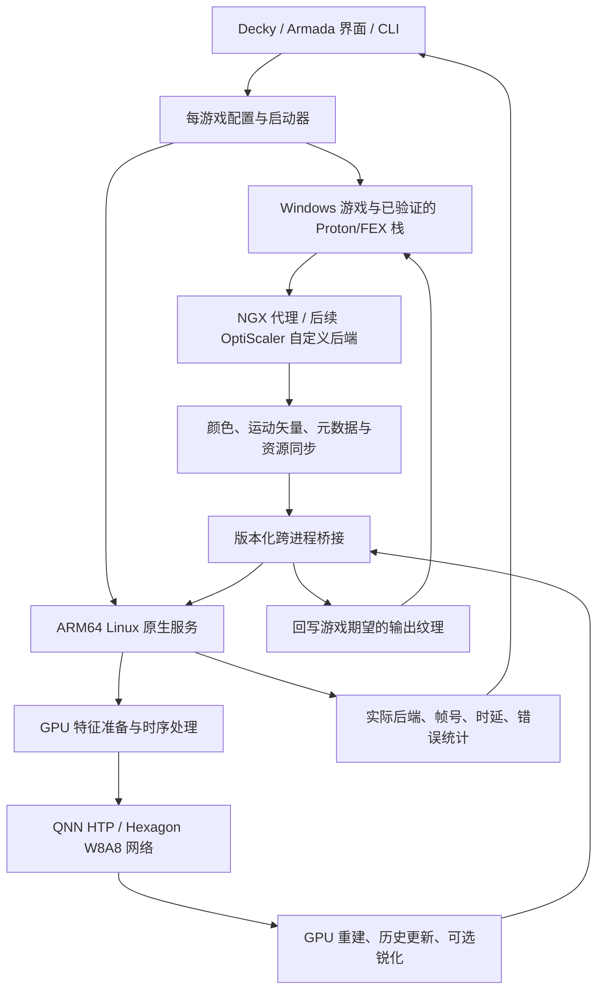

> **技术研究归档 · 2026-09-20**
> 原文来自提交 [`4bd72a7`](https://github.com/54pkp/Decky-FSR4-to-Hexagon/commit/4bd72a710d2f07ffeb765bb5363f5ba64714d320)，技术正文保留。后续实施计划和实际进度请看[节点路线](../roadmap/README.md)与[状态页](../STATUS.md)。

# Decky FSR4 to Hexagon

中文 | [English](2026-09-20-feasibility.en.md)

面向 **AYN Odin 3 / Snapdragon 8 Elite / ARM64 Linux** 的研究与实施方案：截获游戏的 DLSS Super Resolution 调用，用 Hexagon NPU 执行 FSR4 的神经网络部分，再把重建结果写回游戏的输出纹理；最终通过 Steam 启动集成和 Decky 风格界面管理。

**状态：研究方案，尚无本项目可安装插件、运行时或真机验收结果。** 本次完成了上游源码审计与路线设计，没有在 Odin 3 上运行任何测试。下文的目标架构、命令、接口和节点，凡标为“拟议”的都不是已交付功能。

研究日期：**2026-09-20**。用户指定设备为 Odin 3、骁龙 8 Elite，系统 **Armada OS** ，具体镜像、内核、Steam/Proton 版本和首个游戏待核验。官方设备表将 Odin 3 列为 SM8750；设备树也包含 CQ8725S 标识。系统支持设备不等于 QNN/FSR4 已可用。[S5][S5a]

## 1. 先回答接入方式

| 问题 | 结论 |
| --- | --- |
| 必须使用 OptiScaler 吗？ | **不必须。** `fsr4-hexagon` 自己实现 NGX 代理。OptiScaler 可作为未来多游戏输入适配层，但现成 OptiScaler 没有这里所需的 Hexagon FSR4 后端；需要新增后端或桥接。 |
| 必须使用 ReShade 吗？ | **不需要，也不建议作为主路线。** 普通后处理拿到的最终画面不足以通用地替代引擎时序超分接口。专门编写 ReShade add-on 可以参与接入，但仍需解决输入、同步与 NPU 服务，不能靠一个 FX shader 完成。[S6] |
| 每个游戏换 DLL 即可吗？ | **DLL 是入口之一，不是全部。** 还需要正确的 DLL 加载链、必要的 GPU/NVAPI 能力适配、原生服务、QNN/固件/模型、资源格式与同步。上游不是替换一个 `nvngx_dlss.dll` 就通用可用的发行包。 |
| 能否一个环境变量全局开启？ | **可以设计统一开关，不能凭变量创造支持。** 变量必须被我们实现的启动器/运行时读取。DLL 搜索路径、游戏 API、Proton 前缀、模型形状仍需按游戏处理；只对已验证的游戏启用。 |
| 能否做成 Decky 插件？ | **可以，推荐作为最终管理界面。** Decky 管理安装、游戏配置、服务与诊断；高频图像处理在原生组件中完成。保留 CLI/启动器，避免 Decky 或 Steam UI 变化阻断功能。 |
| “把 FSR4 放到 NPU”是否等于 GPU 完全不用做超分？ | **不是。** 首版应沿用混合路线：GPU 做特征准备、时序重投影、历史状态与重建/锐化，NPU 做适配后的 W8A8 网络；CPU 做控制和必要的拷贝。 |

这里的“伪装”指向游戏提供它预期的上采样接口和必要能力信息，不是模拟 NVIDIA GPU 的全部功能。只承诺研究 **DLSS SR 输入 → FSR4 模型路径**；DLSS Frame Generation、Ray Reconstruction、Reflex 和所有 NVIDIA 扩展不在首版范围。游戏必须本身能在该设备的图形/兼容栈上运行。

**建议路线：先确认 Odin 3 的 NPU 可用，再打通一个可审计的 NGX 代理和一个游戏；随后评估 OptiScaler 后端扩展；最后封装启动器和 Decky。**

## 2. 四个项目实际提供了什么

以下 SHA 在研究日与远程 HEAD 核对一致。描述分为“源码存在”“作者报告”“本项目计划”，互不替代。

| 项目与审计版本 | 已有能力 | 对本项目的作用与边界 |
| --- | --- | --- |
| [`puzzled-pancake/fsr4-hexagon`](https://github.com/puzzled-pancake/fsr4-hexagon/tree/8c7a972ab70e5693828a856da71ce711232af463) `8c7a972` | NGX 代理、游戏纹理读回、TCP、Android ARM64 daemon、GPU 前后处理、QNN FSR4 网络、输出回写 | 算法与游戏接入原型的主要参考；针对 RP6/Android/Wine/Box64/DXVK 的实验，不是通用 Linux SDK。 |
| [`puzzled-pancake/rp6-npu-unlock`](https://github.com/puzzled-pancake/rp6-npu-unlock/tree/31c701d8b0a95cde4398b6af6929cdcf75eb83e8) `31c701d` | RP6 特定 Android 固件的 CDSP/FastRPC 启用研究、设备树和模块补丁 | 提供诊断思路；**不作为 Odin 3/Armada 的安装依赖，不移植刷写脚本**。 |
| [`drewano/hexscale`](https://github.com/drewano/hexscale/tree/29dc6a67c764513b3e85beb9cf548bce133a1899) `29dc6a6` | Vulkan present 层、GPU CAS、CLI、IPC、服务、Decky 框架、NPU 资产准备 | 可参考外围工程；此版本 QNN 执行仍有空实现，不能当作已运行的 NPU 超分。 |
| [`54pkp/hexscale`](https://github.com/54pkp/hexscale/tree/8fed58387dcd5b417910b71f15b12d3aa1e509fa) `8fed583` | 真实 QNN provider/graphExecute、帧 IPC、Vulkan 读回与上传、XLSR 分块处理、ARM64 打包和开发验证 | 优先复用服务/诊断/打包经验；**不是 FSR4**，没有 Odin 3/Armada 真机验证。其 XLSR 与离线 ANVIL 路径不能冒充 FSR4 时序重建。 |

### 2.1 `fsr4-hexagon`：有闭环，也有重要限制

源码中的主要闭环是 `proxy/full_proxy.c` 的 **D3D11 NGX Create/Evaluate → staging 纹理 → TCP → live_daemon → QNN + GLES → D3D11 UpdateSubresource**。不只是 ONNX 离线推理。但 D3D12 Create/Evaluate 返回不支持，Vulkan 也未提供等价实现；`injector/d3d12_inject.c` 的作用是特定游戏注册表注入，不能把文件名当成 D3D12 渲染支持。[S1a][S1b]

上游 `docs/REPRODUCING.md` 要求游戏启用 DX12，与上述 D3D11 实现存在需要复现澄清的矛盾。其 Quality 档位说明与代理的尺寸查询也不能直接对应。必须用实际 NGX 入口日志、纹理尺寸、模式和游戏构建号确认，而非仅依菜单名称。[S1a][S1c]

算法版本固定为 FidelityFX SDK **2.0.0 的 fsr4 v07**，经重建/重新分区转为 W8A8，首个卷积等工作留在 GPU。上游使用 QAIRT 2.50、HTP v73；1080p 与 720p 使用不同形状的模型构建。它不是“最新 FSR4 DLL 自动在任何 Hexagon 上运行”。当前 AMD FSR SDK 的版本与该研究快照不同，首轮不要同时升级模型和平台。[S1d][S10]

`live_daemon.c` 与 `qnn_service.c` 是实际研究对象。`fsr4_service.h` 的部分注释仍描述静态 history、单线程等较早合同，生产 split 路径已更新 history/recurrent state。服务 API 在 `.c` 中有实现，但构建脚本将它们联编为 Android executable，并未提供可直接安装的通用 Linux SDK。[S1e]

还需补齐游戏输入语义：当前代理定义了 depth 键却未消费；NGX reset 未传入 live 链；曝光未按完整游戏参数透传；历史重置主要依赖运动阈值。上游还可能回退双线性或重显缓存帧。因此“看到了图像”不能证明每帧来自 NPU，必须统计真实 HTP 执行、fresh output 和 cached redisplay。[S1a][S1e]

作者在 RP6 的单游戏基准中报告最低画质 1080p 输出从 29.5 到 36.1 FPS，同时功率从 9.4 到 11.5 W，单位帧能耗约持平。这不是本项目测量，更不是 Odin 3 性能预测。作者说明异步队列累计约 **4 帧画面年龄，30 FPS 时约 133 ms**，这是架构估算而非输入延迟实测。W8A8 与参考 INT8 图的接近程度，也不能证明与原版 FP16 FSR4 的动态画质等价。[S1f]

### 2.2 两个 `hexscale` 版本：外围工程与算法要分开

上游 `qnn_backend.cpp` 的 `load_context_binary` 主要读取文件，`execute_dmabuf` 尚无真实推理；present 路线实际可见的是 fragment shader CAS。不能依据 NPU 字样、接口名称或返回成功判断模型在执行。[S3]

你的 fork 在 `qnn_runtime.cpp` 中真正调用 QNN；`frame_processor.cpp` 是 **RGB 单帧空间模型**的预处理、分块和后处理。其 XLSR 模型为 128×128 → 512×512，随后再重采样到请求尺寸。present 层保持交换链尺寸，不会自动降低游戏内部渲染分辨率，也拿不到通用的引擎运动矢量、抖动、曝光和重置语义。[S4a][S4b]

因此不能把 FSR4 context 换到 XLSR 模型位置就完成集成：张量通道、量化、历史状态和 GPU 前后处理都不同。独立的 ANVIL 插帧工作也不是本次所需功能。已有 Windows QNN CPU/Vulkan 测试证明部分实现路径可工作；交叉编译 AArch64 ELF 和离线生成 v79 context，均不等于 HTP 真机测试。[S4c]

已有 Decky 面板主要控制 daemon，没有完成本项目所需的逐游戏代理部署和 Steam 启动管理。fork 中 sharpness/profile 的控制值也不能当作已生效的 GPU 锐化或 HTP 电源设置。[S4c]

### 2.3 Odin 3 应优先核验现有平台支持

Armada 当前源码已为 Odin 3 启用 CDSP 节点、提供对应固件，并在内核配置中启用 FastRPC。因此第一步是检查**用户安装版本是否包含并实际运行这些组件**，不是先给设备“解锁”。源码配置不能证明固件加载成功、用户权限正确或 QNN runtime 与内核 ABI 匹配。[S5a][S5b]

`rp6-npu-unlock` 针对 RP6 的特定 Android 13 固件；README 明确成功启动记录同时使用过模块补丁，未单独验证仅设备树覆盖的路径。这些结论不能推广成 SM8750 通用 Linux 步骤。[S2]

## 3. 目标架构与组件职责（拟议）



图中 GPU 处理首轮放在服务独立上下文中，以便移植上游算法；后续如果可验证地减少跨上下文拷贝，再移至游戏进程或 Vulkan 桥接层。NPU daemon 始终是原生 ARM64 Linux 程序，不在 x86 翻译环境中加载 Android QNN 库。

| 组件 | 职责 | 首版明确不承担 |
| --- | --- | --- |
| 游戏适配器 | NGX 初始化/能力/创建/评估/销毁，准确映射输入，按 API 写回结果 | GPU 全面仿真、帧生成、光追重建 |
| `fsr4hex-daemon`（拟议名称） | 会话管理、模型验证、GPU/NPU 调度、历史状态、统计 | 扫描并修改所有游戏、绕过系统驱动限制 |
| `fsr4hex-run` / CLI（拟议） | 选择 AppID 配置、预检、加载代理、启动服务、退出恢复 | 仅靠设置变量就启用未知游戏 |
| Decky 前后端（拟议） | 健康状态、游戏开关、模型档位、诊断与回滚 | 在 Python/JS 中搬运或推理每一帧 |
| 可选 Vulkan 层（后续） | 已明确位置的资源互操作、诊断或空间模式 | 仅在 present 拦截就自动还原所有时序输入 |

## 4. 接入层选择：先最小闭环，再扩大覆盖

### 路线 A：定向 NGX 代理，作为第一阶段

1. 固定一个已有 DLSS SR、无反作弊干扰、能在设备上运行的游戏与 API；先从上游 D3D11 代理能覆盖的入口做探针。
2. 复用已验证的 NGX 协议知识，实现能力查询、尺寸/模式选择、Create/Evaluate/Release 与错误传播。
3. 按需要配置 DXGI/NVAPI 的能力适配，让游戏调用代理；这些只解决入口，不执行 NPU 推理。
4. 用真实 Evaluate 调用计数、NPU 执行计数和输出纹理标记证明闭环。

**DLL 名称必须由该游戏的加载路径决定。** `nvngx.dll`、`nvngx_dlss.dll`、`dxgi.dll` 等处在不同位置，不能互换理解。上游的 `nvngx.dll`、`nvapi64.dll`、注册表注入器和 `dxvk.conf` 是其特定组合，不是全游戏安装清单。首版不要同时让 OptiScaler 与自写代理争夺同一入口。

### 路线 B：给 OptiScaler 增加 Hexagon 后端，作为覆盖扩展

OptiScaler 已处理多种输入 API、游戏差异和输出后端，是合理的长期适配候选。[S7] 需要新增明确的 `FSR4-Hexagon` 后端，将标准化输入送往我们的服务；选择它已有的 AMD GPU FSR4 输出不会自动转移到 NPU。

工作包括资源状态/队列适配、模型能力报告、错误与回退、D3D11/D3D12/Vulkan 分别验证，并核对 GPL-3.0 与新增代码的分发方案。路线 A 和平台门槛通过后再维护这个较大的 fork；能够向上游贡献时优先减少长期补丁。

### 路线 C：统一启动器 / Proton 集成，作为分发方式

先集中存放版本化运行时，按游戏安装最少的代理和配置；保留哈希、备份与恢复记录。随后评估启动时部署、临时映射或兼容工具包装器，使用户不必手动复制 DLL。它减少操作，并不会消除每游戏接入差异。

`LD_PRELOAD` 不能直接作为 Windows PE DLL 的通用替换方法；`WINEDLLOVERRIDES` 只影响对应 Wine 加载链。Steam 容器、RootFS、FEX thunk、Proton 的路径与环境继承必须逐一验证。

## 5. Linux ARM 移植的关键工程点

### 5.1 架构、驱动与 QNN

不要将“ARM64 Linux”“Android ARM64”“ARM64EC Windows DLL”视为同一种 ABI。

- 服务使用匹配系统 libc/加载器的 **AArch64 Linux QNN/QAIRT** runtime、FastRPC 用户态库和正确 HTP Stub/Skel；Android bionic `.so` 不能直接替代 glibc 库。[S11]
- Odin 3 按 **SM8750 平台族 / 预期 HTP v79** 准备，实机可能显示 CQ8725S；QNN SoC 枚举以 SDK/设备验证为准，不等同于 Linux SoC ID。本方案为 v79 重新生成 context，不假定 RP6 的 v73 context 兼容。fork 已离线生成 `socModel=69`、`dspArch=79` 的 XLSR context，仅作工具链参考，FSR4 仍需单独转换。[S4d][S5a]
- context 锁定模型哈希、QAIRT 版本、SoC/HTP、张量形状、精度与量化参数；不同组合的兼容性不能凭文件扩展名推断。
- 当前官方 Proton 已有 ARM64 构建说明，不能笼统声称“不支持 ARM64”；同时官方明确 ARM64 构建不能用于经 FEX 运行的 x86 Steam。优先保持 Armada 已配置的 Steam/Proton/FEX 组合。[S8]
- 传统 x86-64 Wine/Proton 栈通常需要 x64 PE 代理；ARM64/ARM64EC 混合栈需验证实际 DLL ABI 与加载策略。不能把所有 DLL 改编译成 ARM64，也不能先假定一个 x64 DLL 覆盖所有组合。
- Vulkan 层必须加载在正确的 guest/host 边界：x86 ELF 层与 AArch64 ELF 层不能直接互换。FEX 支持图形库转发不代表新增的层、扩展和句柄已自动兼容。[S9]
- 使用普通桌面用户运行推理服务。FastRPC dynamic PD、listener 或 `cdsprpcd` 的需求依 BSP/运行时决定，不把某个进程名称设为所有设备的硬门槛。[S11]

### 5.2 GPU 前后处理与 NPU 张量

先保留计算顺序和量化定义，用离线输入在 Linux EGL/GLES 上复现；移除 Android NDK、`libandroid`、AHardwareBuffer 依赖。**上游通过 AHardwareBuffer/gralloc 与 Android EGL 扩展建立的桥接属于 Android 特定路径**；EGLImage 本身并非 Android 专属，Linux 可以保留该机制，但需替换并验证内存分配、导入和同步实现。不能复制后宣称 Linux 零拷贝已实现。需要时再把 GLES compute 移植到 Vulkan compute，并逐阶段对照参考输出。

建议分两种清晰命名的模式：

| 模式 | 目的 | 边界 |
| --- | --- | --- |
| `research-compatible`（拟议） | 尽量复现上游模型、颜色处理、历史与异步行为，定位移植差异 | 复现作者实现不等于与官方 FSR4 所有路径等价 |
| `temporal-correct`（拟议） | 按当前帧语义、游戏输入与完整历史生命周期修正，作为产品候选 | 需要新的画质与性能验收，不能继承上游分数 |

首个固定档建议沿用 **960×540 → 1920×1080** 的形状，便于比较；资源或延迟不合适时另建 **640×360 → 1280×720** 档。720p 输出在 1080p 面板上的显示缩放需单独说明。其它倍率、DRS、HDR、超宽屏都不能通过“改输出尺寸”直接获得支持。

M2 的具体操作顺序（开发步骤，尚未在 Odin 3 执行）：

1. 从自行合法取得的 SDK 固定 `fsr4_model_v07_i8_quality` 来源、许可和哈希；按 `model/extract/build_weights.py` 生成权重与图描述，先运行 simulator 检查。
2. 按 `model/onnx/` 构建参考图，再复核 clip-free Q/DQ 和 dummy output 等上游 workaround 在所选 QAIRT/v79 上是否仍需保留；不盲目删除算子。
3. 在锁定的工具环境做 ONNX → DLC → W8A8 量化，保存校准输入清单、编码与逐 tensor scale/offset。FSR 上游使用 QAIRT 2.50，fork 使用 2.45；分别记录，不混搭头文件、工具与 runtime 后假定兼容。
4. 为实际 SoC/HTP 与固定分辨率生成 context，核对内部 graph 名、布局和输出数量。上游 1080p NPU 接口为 INT8 NHWC `[1,540,960,16]` → `[1,1080,1920,8]`，并非普通三通道 RGB；最终以实际 graph 元数据为准。[S1d][S1e]
5. 依次验证权重/ONNX 参考、QNN 图输出、GPU 特征与重建、连续帧最终输出；报告最大/平均误差及动态画质。GPU 特征与 INT8 编码是一套合同，不能只验证最后一张 RGB 图。
6. 保存模型清单：源版本、转换脚本 SHA、QAIRT、SoC/HTP、输入输出形状/类型/量化、graph 名、shader 哈希与测试报告；换档或升级需重新匹配整套清单。

### 5.3 帧协议与时序语义（拟议 v1）

控制协议与帧协议分离。首先实现**同帧、单请求、同步返回的正确性基线**，之后才优化吞吐。

| 数据 | 需要记录或校验 |
| --- | --- |
| 会话与版本 | 协议版本、session/context ID、模型哈希、功能位、错误码 |
| 帧身份 | frame ID、输入/输出尺寸、时间戳、历史 generation；拒绝错会话或过期响应 |
| 纹理描述 | 格式、颜色空间、row pitch、stride、长度、有效区域、输入输出容量 |
| 时序输入 | 颜色、运动矢量及其单位/方向/尺度、jitter、reset、曝光/pre-exposure；按输入 API 和算法需求处理 depth、深度反转与可选 masks |
| 同步 | 输入可读、NPU 完成、输出写回和游戏继续使用资源的边界；明确资源生命周期 |
| 能力限制 | 模型支持的固定形状/格式、会话数量、超时和最大报文；不支持即拒绝或选已验证回退 |

上游 live 实验输入链不等于完整 FidelityFX 输入合同；保留 NGX 提供的 depth 等语义，明确哪些被算法使用、哪些尚未使用。没有映射依据时不能将某张深度/运动纹理当成正确输入。

每个超分 context 独立维护 history/recurrent state。切场景、显式 reset、尺寸变化、模型切换、断连重连、暂停/恢复或不连续帧，必须触发可测试的重置策略。运动矢量用平移图案校验方向、单位与 Y 轴；jitter 和曝光不能长期硬编码。

上游用多帧流水提高吞吐，但 **Evaluate(n) 返回 n-k 的图像可能与游戏当前 HUD、后处理和历史错位**。首版不把这种行为默认包装成“低延迟”。异步模式需要独立说明帧年龄和历史推进规则，并做交互延迟验收。

D3D12 扩展还需解决命令提交时点：Evaluate 获得的 command list 可能尚未由游戏提交，不能在回调里等待该未提交工作对应的 fence，也不能擅自关闭/提交游戏拥有的列表。先用独立样例确定拦截提交或互操作方案；D3D11 的 staging/Map 路径不能直接平移为 D3D12 实现。这是依据 D3D12 显式提交/同步模型提出的工程约束。[S12]

### 5.4 传输优化逐级证明

1. **复制基线：** 游戏 GPU readback → loopback TCP → ARM64 服务 → 返回 → GPU upload。TCP 比跨 Wine 的 Unix FD 传递容易建立第一条链路；只监听本地，使用会话凭证，限制报文大小和超时。控制面可以用 Unix socket。
2. **共享内存：** 原生侧评估 memfd/tmpfs 环形缓冲；PE 侧需明确 Wine Unix bridge 或映射方案，不能假设 WinSock 可发送 `SCM_RIGHTS`。不用普通磁盘文件承载高频整帧写入。
3. **GPU ↔ NPU 共享内存：** 单独验证 Vulkan 外部内存、DMA-BUF/分配器、QNN 注册类型、cache coherency、layout/stride 和 fence。能导出 fd 不代表 HTP 能合法注册或读到最新数据。
4. **端到端互操作：** 即使服务内部共享成功，D3D→DXVK/vkd3d→Wine/FEX→host 的资源导出仍需独立解决。按实测拷贝数和时延描述，不先承诺“零拷贝”。

作为容量估算，上游 1080p raw wire 每帧约为 2.07 MB 颜色 + 4.15 MB 运动矢量 + 8.29 MB RGBA8 输出，合计约 **14.52 MB，30 FPS 时约 435 MB/s** 的双向逻辑载荷。它尚未包含 GPU/CPU staging、NPU tensor 和额外副本，不是实测 DRAM 带宽；可见仅压低 graphExecute 时间不足以保证收益。RGBA8 返回也不能保留完整 HDR 精度。[S1a]

错误回退必须保持 API 语义：创建前不可用就报告不支持；运行中故障只切换到已实现且同帧有效的输出路径，必要时停用并提示重启。不能把低分辨率原图直接返回到高分辨率输出、无限等待、用旧帧冒充成功，或偷偷用 CPU 推理并标记 NPU。

## 6. Steam / Decky 的目标体验（拟议）

1. 安装一次 ARM64 用户服务、CLI、适配器包和可选 Decky 插件；模型和专有运行库按各自许可由用户准备。
2. “设备检测”分别显示驱动、CDSP/FastRPC、QNN、模型、GPU 和游戏接入状态，不能只有一个绿色“已启用”。
3. 在游戏详情选择已验证配置，显示计划写入的文件/启动参数；安装后记录原文件哈希与备份。
4. 启动器选择正确前缀与 ABI，检查服务/模型，设置最少变量；游戏中使用 DLSS SR 作为输入。
5. 显示实际模型、HTP 执行成功计数、fresh/cached 帧、输入/输出帧号、NPU/传输/总耗时和回退原因。
6. 停用或卸载恢复本项目拥有的修改；游戏升级后哈希不匹配时重新检测，不覆盖其它 mod。

以下仅演示**未来接口**，本仓库目前没有这些可执行文件或变量实现，不能照抄获得功能：

```bash
# 拟议 Steam Launch Options：运行时安装并验证后才可能使用
fsr4hex-run --profile auto -- %command%

# 拟议等价形式：变量由未来 wrapper 读取，不是 Steam/Proton 标准变量
FSR4HEX_ENABLE=1 fsr4hex-run --profile auto -- %command%
```

“全局默认启用”应含义为：自动处理**白名单内且预检通过**的游戏。不要把 DLL override、Vulkan layer、GPU spoof 写入所有用户的全局环境。现有 `PROTON_*` FSR 选项即使能加载 AMD GPU FSR4，也不会因此调用本项目 NPU 服务。

游戏档案至少记录 AppID、游戏版本/可执行文件、API、加载 DLL 名称与架构、Proton/FEX 版本、输入语义修正、模型档、文件哈希、冲突检测与恢复清单。优先用户级服务和 XDG 目录，适应 Armada 镜像更新；合并而非覆盖 Armada Control 的逐游戏启动参数。Decky 后端只调用受限控制 API，不把前端输入拼成任意 shell。[S5c]

## 7. 可逐节点推进的工作计划

每个节点产出可保存的报告和明确结论；**未通过门槛不进入依赖它的节点**。产物路径是规划，不代表文件已经存在。

| 节点 | 依赖 | 工作内容 | 完成门槛与产物 |
| --- | --- | --- | --- |
| **M0 设备与版本建档** | 无 | 核验型号/SoC、Armada 镜像、内核、Mesa/Turnip、Steam/Proton/FEX、Decky；记录未修改基线 | `docs/devices/odin3-armada.md`；可运行普通游戏，保存原配置；选定候选 DLSS SR 游戏及 API |
| **M1 NPU 平台闸门** | M0 | 检查固件、FastRPC、权限、Linux QNN 库 ABI；用已知小图做真实 HTP 执行 | `artifacts/M1/` 日志 + `docs/validation/M1.md`；冷启动/重复运行成功、输出可对照、明确 HTP 后端；失败则定位平台层 |
| **M2 FSR4 v79 离线移植** | M1 | 固定合法来源的 v07 模型与工具；生成 v79 context；移植 GPU 前后处理；构建序列重放 | `docs/models/fsr4-v07-v79.md`；逐阶段误差、量化、哈希齐全，连续帧输出有效；不能用 XLSR 代替 |
| **M3 游戏接口探针** | M0，可与 M1/M2 并行 | 检查 DLL/NGX 调用与 PE ABI；记录颜色、MV、尺寸/元数据；不接 NPU，先验证纹理写回 | `profiles/<appid>.json` + 报告；确认真实 Evaluate、输入语义和正确 API；只有 DLSS 菜单不算通过 |
| **M4 同帧端到端闭环** | M2 + M3 | 接协议、复制基线、GPU/NPU 与输出；带帧号验证 | `docs/validation/M4.md`；对应帧 NPU 结果写回正确纹理；daemon 缺失/中断可控，没有假成功 |
| **M5 时序画质与恢复** | M4 | 验证运动/jitter/曝光、history、reset、切场景；明确拒绝尚不支持的 HDR/DRS | 序列差异报告；无持续错帧/历史污染；切换/重连不泄漏；建议至少 30 分钟稳定运行 |
| **M6 性能与能耗决策** | M5 | 分解 GPU/NPU/IPC 成本；评估共享内存、DMA-BUF 与流水；相同场景 A/B | `docs/benchmarks/odin3-<date>.md`；至少 3 次热稳态重复，p50/p95/p99、实测延迟和能耗齐全；不可用延迟的模式不设为默认 |
| **M7 CLI 与回滚安装** | M4，可与 M5/M6 部分并行 | 用户服务、模型发现、按游戏启用、备份/哈希、版本锁定、卸载 | 安装/升级/停用/卸载后原游戏仍能启动；状态来自实际运行时；CLI 完整操作通过 |
| **M8 Steam / Decky 集成** | M7；默认推荐模式需 M6 | 游戏卡片、预检、启动参数、状态与诊断；适配实际 Decky 宿主 | 手柄操作验收；UI 掉线不影响游戏；CLI 可独立恢复；不传递任意 root 命令 |
| **M9 扩大覆盖** | M5 + M6 | OptiScaler 后端或新增 API；逐游戏 profile；之后研究原生 FSR 输入 | 每个游戏/API/Proton/模型组合有记录；一款成功不自动标记其它游戏支持 |

推荐顺序：**M0 → M1 → M2，与 M3 并行；M4 → M5 → M6；M7 → M8；最后 M9。** M1 阻塞时仍可做 M3 和离线算法准备，但不能将 CPU 测试标成 NPU 完成。

### 首次在掌机上收集的信息

以下为已有 Linux 工具的只读示例，不执行刷机、驱动修改或解锁。缺工具/权限时记录缺项，不为检查批量更改设备节点权限。

```bash
uname -a
uname -m
cat /etc/os-release
getconf GNU_LIBC_VERSION
cat /proc/device-tree/model
vulkaninfo --summary       # 如果已安装
bootc status              # 如果该 Armada 版本提供
ls -l /dev/fastrpc* /dev/adsprpc* /dev/cdsprpc* 2>/dev/null
ls -l /sys/class/remoteproc/ 2>/dev/null
journalctl -b -k --no-pager | grep -Ei 'cdsp|fastrpc|remoteproc|firmware'
```

设备节点不存在不自动意味着硬件熔断：先区分内核、设备树、固件、用户态 ABI 和权限；节点存在也不意味着 QNN 图可运行。可借鉴 fork 的 `hexscale-qnn-probe` 和模型清单，但必须继续执行实际图并核对输出。[S4c]

首个游戏尚未指定。优先离线/单人、有可重复基准、已确认 DLSS SR 输入、当前 Armada 可稳定运行的游戏。上游 Rise of the Tomb Raider（AppID 391220）只是候选，需先解决文档/API 矛盾并确认用户拥有游戏。另一个 DX12 游戏放在后续兼容性节点。

## 8. 画质、性能与“成功”的定义

| 对照组 | 解决的问题 |
| --- | --- |
| 原生目标分辨率，无本项目 | 游戏与驱动的原始表现 |
| 相同低分辨率 + 已有可用空间/时序上采样 | 收益是否只是降低渲染分辨率 |
| FSR4 NPU 同帧复制基线 | 输出正确性与完整成本 |
| 每次只改变一个优化的版本 | 改善来自哪里，是否引入延迟/画质损失 |
| 固定模型的 FP/量化参考与多帧重放 | 分离量化、移植和时序误差；参考不可获得时明确记录 |

覆盖快速转镜、细线/栅栏、粒子/透明物体、遮挡显露、HUD/字幕、切场景、曝光变化、暂停/恢复。静态截图、合成平移和 INT8 自洽只能覆盖部分问题。

记录游戏渲染、readback、CPU 转换、IPC、GPU 特征、NPU graphExecute、GPU 后处理、upload、完整帧时间和队列深度/帧年龄。用单调时钟及 GPU timestamp，说明跨时钟对齐方法；输入到显示延迟另行测量，不能以 NPU 时间替代。

30 FPS 为 33.3 ms/帧，60 FPS 为 16.7 ms/帧；这是目标周期，不是每个模块都可独占的预算。流水线提高吞吐不能抹去延迟。对齐输出分辨率、画质、场景、亮度、风扇、电源和热稳态，有/无帧率上限分别记录。

报告功率、帧数、时长、温度/频率、能量每帧（总能量 ÷ 实际帧数）及误差。更高 FPS 不必然省电，NPU 更快也可能被 GPU 前后处理和传输抵消；不预设 8 Elite 比 RP6 快多少。

验收最低条件：**真实 HTP 执行 + 对应帧正确返回 + 可接受动态画质 + 可控故障/回滚 + 完整性能证据**。FPS、DLL 加载成功、Decky 变绿都不能单独代表成功。

## 9. 拓展问题：没有 DLSS、只有 FSR4 的游戏

**原则上可以研究，而且不一定需要 DLSS 伪装。** 前提是在游戏的 FSR 接口边界截获输入，不是在 FSR4 执行后再对最终图像做一次 NPU 超分。

| 游戏实现 | 可研究入口 | 主要限制 |
| --- | --- | --- |
| 动态 FidelityFX API / 可替换 upscaler DLL | 兼容 provider/代理，截获 context 创建、查询、dispatch、配置与销毁，转发到同一服务 | DLL 导出、描述符版本、资源状态、输出语义、设备检查需匹配；不能只看 DLL 名称 |
| 静态链接或引擎内集成 | 源码/引擎插件或针对游戏的适配 | 无通用“替换 DLL 即可”保证，维护成本更高 |
| 只标“FSR”，实际为 FSR1/2/3 | 先识别 API 与时序输入 | FSR1 空间输入不能凭设置变成完整 FSR4 时序输入；FSR2/3 自定义接口另行适配 |

FSR4 沿用 FidelityFX API 的演进方向，使动态 API 成为合理候选，但不保证所有游戏可替换。[S10a] 现有 FSR4 游戏可能使用不同于 v07 的版本，替换为本研究路径需明确质量与行为变化。GPU/NPU 分工、v79 context、传输和历史仍需实现。此处仅方向分析，在 **M9** 后单独推进，不提前扩大首版范围。

## 10. 仓库规划与依赖边界

当前只交付中英文方案与忽略规则；以下是后续结构建议：

```text
adapters/ngx/           # 游戏侧 NGX，按 API/ABI 区分
adapters/optiscaler/    # 后续自定义后端补丁，如选择此路线
runtime/               # ARM64 服务、QNN、GPU 前后处理、时序上下文
protocol/              # 版本化控制/帧协议
launcher/              # CLI、Steam 启动包装、安装/恢复
decky/                 # 可选管理界面
profiles/              # 已验证的游戏配置
tools/                 # 设备诊断、模型准备、重放与测量
tests/                 # 合成输入、协议/生命周期/故障恢复测试
docs/                  # 设备、模型、验证、基准与设计决策
```

`research/` 为本地上游检出，`.research-notes/` 为草稿，均不提交。SDK、权重、固件、游戏与原始大体积测试数据放在忽略目录；报告记录来源、版本和哈希。可公开的小型合成测试数据另行纳入版本控制。

四个仓库的自有代码均提供 MIT 许可，但 `fsr4-hexagon` 将 AMD 模型、NVIDIA 接口定义、Qualcomm runtime 和固件分开处理；着色器第三方声明需保留。OptiScaler 为 GPL-3.0，复用代码或分发修改版时需按实际组合核对义务，不能用本仓库一个标签覆盖所有依赖。[S1g][S7a]

本仓库自身许可证仍待确定，不自动改为 MIT。首版不捆绑未确认可再分发的权重、context、SDK runtime、固件或游戏 DLL；优先提供生成过程与来源说明。上游对在线游戏/反作弊的限制影响代理加载方式，首轮限定在允许修改的离线场景，不提供绕过反作弊步骤。

## 11. 源码与官方资料

正文 `[S…]` 指向以下一手来源。固定 SHA 用于复核本次审计，在线文档可能变化。方案与验收门槛是本仓库的工程建议，不是上游已提供的保证。

- **[S1a]** [NGX 代理及 API 实现](https://github.com/puzzled-pancake/fsr4-hexagon/blob/8c7a972ab70e5693828a856da71ce711232af463/proxy/full_proxy.c)
- **[S1b]** [游戏专用注册表注入器](https://github.com/puzzled-pancake/fsr4-hexagon/blob/8c7a972ab70e5693828a856da71ce711232af463/injector/d3d12_inject.c)
- **[S1c]** [上游复现步骤](https://github.com/puzzled-pancake/fsr4-hexagon/blob/8c7a972ab70e5693828a856da71ce711232af463/docs/REPRODUCING.md)
- **[S1d]** [模型转换与形状](https://github.com/puzzled-pancake/fsr4-hexagon/blob/8c7a972ab70e5693828a856da71ce711232af463/model/README.md)
- **[S1e]** [live_daemon.c](https://github.com/puzzled-pancake/fsr4-hexagon/blob/8c7a972ab70e5693828a856da71ce711232af463/daemon/live_daemon.c)、[qnn_service.c](https://github.com/puzzled-pancake/fsr4-hexagon/blob/8c7a972ab70e5693828a856da71ce711232af463/daemon/qnn_service.c)、[fsr4_service.h](https://github.com/puzzled-pancake/fsr4-hexagon/blob/8c7a972ab70e5693828a856da71ce711232af463/daemon/fsr4_service.h)、[Android 构建](https://github.com/puzzled-pancake/fsr4-hexagon/blob/8c7a972ab70e5693828a856da71ce711232af463/daemon/build.sh)
- **[S1f]** [白皮书：测量、延迟与质量限制](https://github.com/puzzled-pancake/fsr4-hexagon/blob/8c7a972ab70e5693828a856da71ce711232af463/WHITEPAPER.md)
- **[S1g]** [第三方依赖与权重边界](https://github.com/puzzled-pancake/fsr4-hexagon/blob/8c7a972ab70e5693828a856da71ce711232af463/THIRD_PARTY.md)
- **[S2]** [RP6 适用范围](https://github.com/puzzled-pancake/rp6-npu-unlock/blob/31c701d8b0a95cde4398b6af6929cdcf75eb83e8/README.md)、[技术记录](https://github.com/puzzled-pancake/rp6-npu-unlock/blob/31c701d8b0a95cde4398b6af6929cdcf75eb83e8/docs/RESEARCH_NOTES.md)
- **[S3]** [上游 Hexscale QNN](https://github.com/drewano/hexscale/blob/29dc6a67c764513b3e85beb9cf548bce133a1899/daemon/src/qnn_backend.cpp)、[Vulkan 层](https://github.com/drewano/hexscale/blob/29dc6a67c764513b3e85beb9cf548bce133a1899/layer/src/layer_entry.cpp)
- **[S4a]** [fork QNN runtime](https://github.com/54pkp/hexscale/blob/8fed58387dcd5b417910b71f15b12d3aa1e509fa/daemon/src/qnn_runtime.cpp)、[RGB 帧处理](https://github.com/54pkp/hexscale/blob/8fed58387dcd5b417910b71f15b12d3aa1e509fa/daemon/src/frame_processor.cpp)
- **[S4b]** [fork Vulkan 呈现](https://github.com/54pkp/hexscale/blob/8fed58387dcd5b417910b71f15b12d3aa1e509fa/layer/src/layer_entry.cpp)
- **[S4c]** [QNN 开发版及验证边界](https://github.com/54pkp/hexscale/blob/8fed58387dcd5b417910b71f15b12d3aa1e509fa/README-QNN.md)、[验证记录](https://github.com/54pkp/hexscale/blob/8fed58387dcd5b417910b71f15b12d3aa1e509fa/docs/validation/0.2.0-dev1.json)
- **[S4d]** [SM8750/v79 元数据](https://github.com/54pkp/hexscale/blob/8fed58387dcd5b417910b71f15b12d3aa1e509fa/models/xlsr-sm8750-v79.json)
- **[S5]** [Armada AYN 设备表](https://armadaos.dev/devices/ayn/)、[Armada 项目](https://github.com/armada-os/armada)
- **[S5a]** [Odin 3 设备树](https://github.com/armada-os/armada/blob/d38f6d9fd18b50294c14cd4081e896fc86af12db/packages/kernel/dts/cq8725s-ayn-odin3.dts#L242)、[固件目录](https://github.com/armada-os/armada/tree/d38f6d9fd18b50294c14cd4081e896fc86af12db/system_files/usr/lib/firmware/qcom/sm8750/ayn/odin3)
- **[S5b]** [Armada FastRPC 内核配置](https://github.com/armada-os/armada/blob/d38f6d9fd18b50294c14cd4081e896fc86af12db/packages/kernel/config/armada-kernel.config.overrides#L57)
- **[S5c]** [Armada Control](https://armadaos.dev/using-armada/armada-control/)、[Armada Steam/Proton 配置](https://github.com/armada-os/armada/blob/d38f6d9fd18b50294c14cd4081e896fc86af12db/build_files/30-install-steam-session.sh)
- **[S6]** [ReShade 功能与 add-on](https://github.com/crosire/reshade/blob/main/README.md)
- **[S7]** [OptiScaler 输入/输出与 API](https://github.com/optiscaler/OptiScaler/blob/93fbf1b2696112945f87d8a2cea9bdada5720d25/README.md)、[能力适配](https://github.com/optiscaler/OptiScaler/blob/93fbf1b2696112945f87d8a2cea9bdada5720d25/Spoofing.md)
- **[S7a]** [OptiScaler 许可证](https://github.com/optiscaler/OptiScaler/blob/93fbf1b2696112945f87d8a2cea9bdada5720d25/LICENSE)
- **[S8]** [Valve Proton ARM64 构建](https://github.com/ValveSoftware/Proton/blob/5b89db940e0ebe3a137a6009a3589232fe084c09/README.md#L192)
- **[S9]** [FEX 官方说明](https://github.com/FEX-Emu/FEX/blob/main/Readme.md)、[Decky Loader](https://github.com/SteamDeckHomebrew/decky-loader)
- **[S10]** [当前 AMD FSR SDK](https://gpuopen.com/manuals/fsr_sdk/)
- **[S10a]** [AMD FSR4 与 FidelityFX API](https://gpuopen.com/learn/amd-fsr4-gpuopen-release/)、[FSR API](https://gpuopen.com/manuals/fsr_sdk/getting-started/ffx-api/)
- **[S11]** [Qualcomm FastRPC](https://github.com/qualcomm/fastrpc)、[FastRPC daemon 说明](https://github.com/qualcomm/fastrpc/blob/development/Docs/daemons.md)、[QNN Linux/Android 构建目标](https://github.com/onnxruntime/onnxruntime-qnn/blob/main/docs/execution_providers/build.md#linux-builds)
- **[S12]** [Microsoft D3D12 命令提交与同步](https://learn.microsoft.com/en-us/windows/win32/direct3d12/executing-and-synchronizing-command-lists)

[S1a]: https://github.com/puzzled-pancake/fsr4-hexagon/blob/8c7a972ab70e5693828a856da71ce711232af463/proxy/full_proxy.c
[S1b]: https://github.com/puzzled-pancake/fsr4-hexagon/blob/8c7a972ab70e5693828a856da71ce711232af463/injector/d3d12_inject.c
[S1c]: https://github.com/puzzled-pancake/fsr4-hexagon/blob/8c7a972ab70e5693828a856da71ce711232af463/docs/REPRODUCING.md
[S1d]: https://github.com/puzzled-pancake/fsr4-hexagon/blob/8c7a972ab70e5693828a856da71ce711232af463/model/README.md
[S1e]: https://github.com/puzzled-pancake/fsr4-hexagon/blob/8c7a972ab70e5693828a856da71ce711232af463/daemon/live_daemon.c
[S1f]: https://github.com/puzzled-pancake/fsr4-hexagon/blob/8c7a972ab70e5693828a856da71ce711232af463/WHITEPAPER.md
[S1g]: https://github.com/puzzled-pancake/fsr4-hexagon/blob/8c7a972ab70e5693828a856da71ce711232af463/THIRD_PARTY.md
[S2]: https://github.com/puzzled-pancake/rp6-npu-unlock/blob/31c701d8b0a95cde4398b6af6929cdcf75eb83e8/README.md
[S3]: https://github.com/drewano/hexscale/blob/29dc6a67c764513b3e85beb9cf548bce133a1899/daemon/src/qnn_backend.cpp
[S4a]: https://github.com/54pkp/hexscale/blob/8fed58387dcd5b417910b71f15b12d3aa1e509fa/daemon/src/qnn_runtime.cpp
[S4b]: https://github.com/54pkp/hexscale/blob/8fed58387dcd5b417910b71f15b12d3aa1e509fa/layer/src/layer_entry.cpp
[S4c]: https://github.com/54pkp/hexscale/blob/8fed58387dcd5b417910b71f15b12d3aa1e509fa/README-QNN.md
[S4d]: https://github.com/54pkp/hexscale/blob/8fed58387dcd5b417910b71f15b12d3aa1e509fa/models/xlsr-sm8750-v79.json
[S5]: https://armadaos.dev/devices/ayn/
[S5a]: https://github.com/armada-os/armada/blob/d38f6d9fd18b50294c14cd4081e896fc86af12db/packages/kernel/dts/cq8725s-ayn-odin3.dts#L242
[S5b]: https://github.com/armada-os/armada/blob/d38f6d9fd18b50294c14cd4081e896fc86af12db/packages/kernel/config/armada-kernel.config.overrides#L57
[S5c]: https://armadaos.dev/using-armada/armada-control/
[S6]: https://github.com/crosire/reshade/blob/main/README.md
[S7]: https://github.com/optiscaler/OptiScaler/blob/93fbf1b2696112945f87d8a2cea9bdada5720d25/README.md
[S7a]: https://github.com/optiscaler/OptiScaler/blob/93fbf1b2696112945f87d8a2cea9bdada5720d25/LICENSE
[S8]: https://github.com/ValveSoftware/Proton/blob/5b89db940e0ebe3a137a6009a3589232fe084c09/README.md#L192
[S9]: https://github.com/FEX-Emu/FEX/blob/main/Readme.md
[S10]: https://gpuopen.com/manuals/fsr_sdk/
[S10a]: https://gpuopen.com/learn/amd-fsr4-gpuopen-release/
[S11]: https://github.com/qualcomm/fastrpc
[S12]: https://learn.microsoft.com/en-us/windows/win32/direct3d12/executing-and-synchronizing-command-lists
