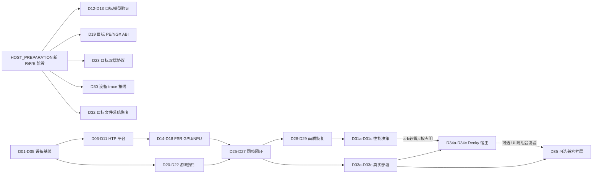

# 设备接入后的执行队列（D01–D35）

本页定义 D 批次的 ID、依赖、执行环境和验收，不复制实时进度；批次状态只看[项目状态](../STATUS.md)。当前没有连接 Odin 3，也没有选定并验证首个游戏；所有真实设备、HTP、游戏、画质、性能和 Decky 宿主检查仍为 `not_run`。本页是设备阶段唯一选批入口；[M0–M9](README.md) 保留技术依据，不再从某个完整 M 节点整体开工。

[项目状态](../STATUS.md) · [无设备准备](HOST_PREPARATION.md) · [轻量流程](../ai/MULTI_AGENT_WORKFLOW.md) · [公共合同](../architecture/CONTRACTS.md) · [审计摘要](../validation/host/2026-09-22-documentation-roadmap-refresh.md)

## 1. 使用规则

- 一次只选择一个 D 批次；每批只证明表中一个行为。实现、针对性检查和一份短批次记录完成后才可改变状态。
- 本页的“需目标设备 / 需目标设备与游戏”是执行条件，不是进度枚举。D 批次初始均为 `not_started`；没有设备时保持 `not_started`，不批量标成 `blocked`。可在 Windows/CPU 提前实现的行为属于 HOST_PREPARATION 的 R/F/E 阶段，不在 D 队列重复实现。
- `device gate` 和 `game gate` 分别记录 `not_run / pass / fail / blocked`。无设备、无游戏或只跑 mock 时保持 `not_run`，不得用 build、Windows CPU、QAIRT CPU、离线 context 或源码审阅升级 gate。
- 设备可用后也先做只读采集和普通用户路径。不得顺带刷机、改设备树/固件/系统权限、运行解锁脚本或把 root 路径当产品通过。
- 每批记录实际仓库 revision、设备/模型/profile ID、环境和后端、命令与退出码、原始证据索引、结论、未测项和下一批。旧的 work-card、独立 review packet、成套 validation + handoff 不是强制交付。
- 无设备准备的 R/F/E 批次由 [HOST_PREPARATION](HOST_PREPARATION.md) 维护；本页按确切叶子 ID 绑定必需产物，可选参考单独标明。必需 host 产物未完成时不能启动依赖它的 D 批，可继续其它独立批次。

## 2. 最小 MVP 与可选扩展

最小**研究同帧 MVP**是一个锁定的 Odin 3 / Armada 镜像 / QNN-FastRPC 组合、一个固定 FSR4 v07 模型与 SDR 固定分辨率、一个 D3D11 NGX 游戏 profile、同帧单 context 单在途、复制 + 本地 TCP 基线。它要求 D01、D05–D29 中适用于该组合的必需项通过；D02–D04 的 Linux/POSIX 欠账必须完成，但只阻断依赖其具体语义的发布/安全结论，不阻断资料已足够时独立推进 D06–D11。研究 MVP 必须证明真实 HTP、真实游戏输出回写、消费确认后 history 提交、失败不返回旧帧，并有 M5 画质/恢复证据。

**CLI 可用交付**在研究 MVP 之上要求 D30、D31a–D31b、D32、D33a–D33c：测量结论完整、部署可恢复、普通用户能够用 CLI 独立诊断/启停/恢复。D31c 只在声明物理 input-to-photon/交互延迟时必需；缺少测量手段不阻断 CLI 本身。性能收益为负仍可完成研究和 CLI 交付，但不得标为推荐模式。**Decky 交付 D34a–D34c 是可选控制层**，不是研究 MVP 或 CLI 可用交付的前置；实现时必须复用 CLI，且无 M6 正向证据时不显示“推荐”。

D35 是 MVP 后的第一个兼容性扩展示范，不是 MVP 前置。D3D12、Vulkan、OptiScaler、原生 FSR API、HDR、DRS、其它分辨率、多视口/多 context 和异步/零复制均需在 D35 之后各自新增连续 D 编号，且每项重新经过相应 M3→M6 gate。Frame Generation、Ray Reconstruction、Reflex 和反作弊绕过不在计划内。

## 3. D 批次总表

### M0：真实设备与 Linux 基线

| ID | 执行条件 | 依赖 | gate | 一次可验收行为 |
| --- | --- | --- | --- | --- |
| D01 | 需目标设备 | 无；现有 M0 collector | device | 以普通登录用户在真实 Odin 3 运行只读采集，并人工对照镜像、内核、libc、device-tree、SoC、GPU、remoteproc、FastRPC 节点和权限；验收为一个可校验的私有 profile 与脱敏摘要，未知值保持 `null`。 |
| D02 | 需目标 Linux | D01 | device | 在目标 Linux 实跑普通文件、目录外 symlink、悬空 symlink、不可读路径和替换时序；验收为 collector/validator 的 POSIX symlink 行为与策略一致，不能用 Windows junction 结果代替。 |
| D03 | 需目标 Linux | D01 | device | 在目标 Linux 触发正常退出、超时、产生后代进程和继承管道四种命令；验收为进程组回收、SIGTERM/SIGKILL 顺序和 `SIGALRM`/超时诊断有界且无遗留进程。 |
| D04 | 需 POSIX Linux | D01；可参考 R01–R05 的所有权/路径策略，不以其 Windows 结果为前置证据 | device | 对 P4 POSIX 目录检查到 hardlink 的替换竞态做受控对抗测试；验收为工具只发布自己已验证并拥有的 inode/目录，竞争者内容不被读取、覆盖或清理。 |
| D05 | 需目标设备 | D01；并行吸收 D02–D04 已有结论 | device；game 可为 `not_run` | 冻结未修改基线：`device_profile_id`、镜像/内核/runtime/图形/Steam-Proton-FEX/Decky 版本及升级重测条件；验收为 M1 平台输入和 M3 游戏输入明确分开，未选游戏不阻塞 M1。 |

### M1：真实 Linux QNN / HTP 平台

| ID | 执行条件 | 依赖 | gate | 一次可验收行为 |
| --- | --- | --- | --- | --- |
| D06 | 需目标设备 | D01、D05；可参考 P4 包内 ABI 清单及 R06a–R06c 主机快照/环境收据，不以它们代替目标库闭包 | device | 固定实际 host backend/system/stub、DSP skel、loader、libc 和传递依赖，逐文件记录来源、角色、ELF machine/interpreter/versioned symbols/hash；验收为真实库闭包的 loadability 结论，不以包内文件名或 Android bionic 库代替。 |
| D07 | 需目标设备 | D06 | device | 只用普通用户验证 FastRPC/CDSP 安全域、PD/listener、firmware、设备节点、组和访问策略；验收为分层诊断记录完整。只有普通用户实际打开所需域/会话才可将可用 gate 记为 pass；失败诊断可完成本批记录，但不能解除 D08–D11 的 HTP 成功依赖。 |
| D08 | 需目标设备 | D06–D07 | device | 从显式路径加载 provider/backend 并查询实际 API/version/backend ID；请求 HTP 时注入 CPU 库必须确定性拒绝，验收记录绝对路径和 hash，禁止静默 fallback。 |
| D09 | 需目标设备 | D08 | device | 加载一个已知小图 context 并枚举 graph/tensor 元数据；验收 shape、dtype、encoding、字节容量和释放顺序与 manifest 一致，加载失败后重试不复用半初始化状态。 |
| D10 | 需目标设备 | D09 | device | 用零、固定图案、固定种子非零三类输入各执行一次真实 HTP `graphExecute`；验收输出随输入变化、在预声明容差内，并有 profiling/设备日志证明不是 CPU。 |
| D11 | 需目标设备 | D10 | device | 对同一小图执行至少 1,000 次并完成至少 10 次独立进程创建/销毁，覆盖一次受控错误；验收无未解释错误、旧输出、持续 RSS/DSP 资源增长或不安全释放，DSP crash 时立即停止压力测试。 |

### M2：完整 FSR4 模型、GPU 流水与离线序列

| ID | 执行条件 | 依赖 | gate | 一次可验收行为 |
| --- | --- | --- | --- | --- |
| D12 | 需目标设备资料 | D05、D11、F03、F08a；合法固定资产 | device | 用实际 SoC/HTP/runtime 组合冻结目标模型 manifest，并把 host 完整参考图与真实设备的 graph/tensor 能力枚举对齐；验收为 shape/dtype/layout/encoding/资产 digest 和未知项可追溯，不把 host reference 本身算设备通过。 |
| D13 | 需目标设备资料 | D12、F04c、F05、F06b | build / `context_generated`；device execution `not_run` | 针对 D12 的实际 SoC/HTP/SDK 组合生成完整网络 context/prepare 并严格核对 metadata；验收 signedness、scale/offset、粒度、dummy outputs、饱和边界和不支持算子与真实目标参数一致。生成可在 host 进行，但没有设备参数不得开批；本批不能算 context 已在设备加载或 HTP 已执行，真实 gate 留给 D14。 |
| D14 | 需目标设备 | D11、D13 | device | 在真实 HTP 对固定输入做关键中间 tensor 与最终 NPU 子图输出比对；验收为实际 v79/SoC context、真实 I/O encoding 和逐 tensor 误差，不用 QAIRT CPU 或 offline prepare 代替。 |
| D15 | 需目标设备 | D05；D12 | device | 在实际选定 Linux GPU API 上只接通颜色/MV/jitter/exposure/reset 到 NPU 输入的预处理；验收为固定 frame bank 的 GPU 输出与 CPU reference 对照，并记录同步、格式、stride 和所有权。 |
| D16 | 需目标设备 | D14–D15 | device | 只接通 NPU 输出到 postA/reconstruction/RCAS 的 GPU 后处理；验收为一帧固定输入的阶段输出与 reference 对照，Android NDK/AHardwareBuffer 假设不得直接带入 Linux。 |
| D17 | 需目标设备 | D16 | device | 实现一个 context 的 GPU history/recurrent commit/reset；验收为成功帧才提交、失败/部分更新不提交、reset/换模型递增 generation、迟到输出不能覆盖新 history。 |
| D18 | 需目标设备 | D17 | device | 顺序重放至少 300 帧的静态/运动序列及短 reset/切镜/曝光序列；验收无旧 generation、阶段失败可定位，并明确 research-compatible 与 temporal-correct 模式差异及未消费字段。 |

### M3：真实游戏接口与回写

| ID | 执行条件 | 依赖 | gate | 一次可验收行为 |
| --- | --- | --- | --- | --- |
| D19 | 需目标设备 | D05、E04、E05 | device | 在真实 Armada/FEX/Wine/图形桥接环境运行自有 PE host，验证目标 PE ABI 的 NGX SR Create/Evaluate/Release、参数/vtable 和导出集合；验收为 D3D11 合成纹理可回写，D3D12/Vulkan 明确拒绝。 |
| D20 | 需目标设备与游戏 | D05、D19；用户选定可调试的单机游戏 | device + game | 记录无本项目的干净游戏基线，并证明实际加载链、游戏 build、PE ABI、Proton/FEX/DXVK、实际图形 API 与真实 Evaluate 调用；菜单或 DLL 存在不算通过。 |
| D21 | 需目标设备与游戏 | D20 | device + game | 对一次真实 Evaluate 核对颜色/MV/jitter/exposure/depth/reset、render/display 尺寸、格式、mip/view、RowPitch 与资源状态；验收为字段语义表，未知必需字段拒绝而非补常量。 |
| D22 | 需目标设备与游戏 | D21 | device + game | 在探针模式把已知图案写回游戏提供的正确输出资源并恢复原状态；验收为同一 Evaluate 的读回/写回水印、Create/Release/device-loss 清理和可恢复部署证据。 |

### M4：跨进程同帧闭环

| ID | 执行条件 | 依赖 | gate | 一次可验收行为 |
| --- | --- | --- | --- | --- |
| D23 | 需目标设备 | D05、D19、E01、E02；公共合同 | device | 在实际 PE/FEX/Wine 客户端与 native AArch64 服务两端重放长度、stride、上限、整数溢出、半包、断连、鉴权和稳定错误码；验收双端对同一 wire revision/golden/negative vectors 一致拒绝，不发送内存 struct、COM 指针或 Linux fd 数字。 |
| D24 | 需目标设备 | D23 | device | 建立 PE WinSock→native Linux daemon 的 loopback 复制握手和一个 frame packet 往返；验收 session/context/frame/history/model 六元身份原样回显，断连后旧实例响应被拒绝。 |
| D25 | 需目标设备与游戏 | D18、D22、D24 | device + game | 用固定 profile 完成一次 GPU→HTP→GPU→游戏回写的同帧单在途闭环；验收输入/HTP输出/最终写回水印属于同一 frame，禁止 cached old frame 冒充成功。 |
| D26 | 需目标设备与游戏 | D25 | device + game | 实现图形 API 可消费后的 `result_consumed` 确认；验收只有正确身份且游戏已消费的结果才能 commit history，socket send/receive 成功不能推进 history。 |
| D27 | 需目标设备与游戏 | D26 | device + game | 在受控软件边界模拟“不完成”，并注入迟到完成、写回失败、daemon 重启各一次；不得为测试主动挂死或重置 DSP。验收超时后 buffer/context 不被提前释放或复用，恢复产生新 service/generation，fresh/HTP/writeback 计数不把失败算成功。 |

### M5：时序画质与恢复

| ID | 执行条件 | 依赖 | gate | 一次可验收行为 |
| --- | --- | --- | --- | --- |
| D28 | 需目标设备与游戏 | D27 | device + game | 在锁定场景采集并检查静态细节、快速运动、遮挡/显露、透明/粒子、HUD、切镜和曝光变化；验收包含输入映射、最差片段、参考/差异和预声明判据，不以锐化观感或单张 PSNR 代替时序判断。 |
| D29 | 需目标设备与游戏 | D28 | device + game | 连续运行至少 30 分钟并分别触发 reset、断连、device loss、服务重启、暂停/恢复；验收 history 正确失效/重建、无旧帧和未解释资源增长，格式/尺寸变化未支持时确定性拒绝。 |

### M6：性能、延迟、内存与能耗

| ID | 执行条件 | 依赖 | gate | 一次可验收行为 |
| --- | --- | --- | --- | --- |
| D30 | 需目标设备与游戏 | D27、E07；公共身份合同 | device + game | 将 trace 接入实际设备链路并校准/标注 CPU、GPU、QNN 时钟域；验收真实 capture/readback/传输/preprocess/HTP/reconstruct/return/writeback 事件可关联，同步拒绝不可比时钟，并区分 fresh/cached 与帧年龄。 |
| D31a | 需目标设备与游戏 | D29–D30 | device + game | 在锁定场景采集 off/on 各阶段真实 trace；验收 p50/p95/p99、fresh/cached FPS、帧年龄和端到端软件延迟可复算，graphExecute 不代替整帧成本。 |
| D31b | 需目标设备与游戏 | D31a | device + game | 对同一配置做至少 3 轮热稳态 A/B；验收 RAM/VRAM/DSP 峰值、温度/频率、功率/能量和 J/fresh frame，缺失或范围不明的传感器项保持未知。 |
| D31c | 需目标设备与游戏及测量手段 | D31a | device + game | 用可说明误差的实际手段测 input-to-photon/交互延迟；验收同步方法、样本、分布和误差边界完整。缺测量设备时该叶子保持未运行，不能用软件阶段时延代替。 |

### M7：CLI 与可恢复部署

| ID | 执行条件 | 依赖 | gate | 一次可验收行为 |
| --- | --- | --- | --- | --- |
| D32 | 需目标设备 | D05、E06c；D23 schema | device | 在目标 Linux 文件系统和用户权限下、只对专用临时 fixture 逐步故障注入 `plan→backup→apply→recover→restore`；验收真实 rename/fsync/symlink/权限/锁语义下 hash/revision、外部修改冲突和幂等恢复均保留原文件，不触碰真实游戏安装。 |
| D33a | 需目标设备与游戏 | D27、D32 | device + game | 以普通用户在真实 Steam/FEX/Proton 启动链运行 doctor/status/plan/apply/run/restore；验收原 argv/env 保持、真实后端可辨、冲突 mod 不被覆盖且原游戏可恢复。 |
| D33b | 需目标设备 | D33a | device | 在真实 XDG 与用户会话接入 daemon 服务生命周期；验收启动、握手、重启、退出码/信号、锁和运行目录权限有界，不隐式改用 root。 |
| D33c | 需目标设备与游戏 | D33a–D33b | device + game | 各执行一次升级、停用和卸载/恢复；验收 journal 可恢复、外部修改产生冲突而非覆盖、活动会话不被删文件，升级后 gate 触发正确重测。 |

### M8：真实 Steam / Decky 宿主

| ID | 执行条件 | 依赖 | gate | 一次可验收行为 |
| --- | --- | --- | --- | --- |
| D34a | 需目标设备与真实宿主 | D33b；真实 Decky/Steam 宿主 | device | 加载最小插件并只读探测 Loader/API/Steam UI、运行 UID/架构和 AppID 来源；验收宿主能力表、手动 AppID 回退及 unload 清理，不猜 `currentAppId`。 |
| D34b | 需目标设备与真实宿主 | D33c、D34a | device + game | 建立只允许 M7 CLI 操作的控制桥；验收 request/appid/revision/idempotency 归属、乱序响应、A→B→A 切换和两个游戏配置隔离，不暴露任意 shell/root 调用。 |
| D34c | 需目标设备与真实宿主 | D31a–D31b、D34b | device + game | 以手柄完成选定 AppID 的状态、plan/apply/restore，并卸载/重载插件；验收 enabled/saved/active/HTP/fresh/cached 分离，UI 退出不终止 daemon、CLI 仍可恢复。无 M6 正向证据时不显示“推荐”；未完成 D31c 时物理延迟显示未知。 |

### M9：MVP 后兼容扩展示范

| ID | 执行条件 | 依赖 | gate | 一次可验收行为 |
| --- | --- | --- | --- | --- |
| D35 | 需目标设备与第二个游戏 | 第2节定义的 CLI 可用组合已冻结（不要求 D31c）；D34a–D34c 仅在交付 Decky 时需要；第二个同 D3D11 NGX API 游戏 | device + game | 只增加一个新游戏/build profile，不改变模型、同步架构或图形 API；验收独立重跑 M3–M6 必需 gate 与 M7 恢复，并登记准确的游戏/API/ABI/Proton-FEX/驱动/模型组合，结果不得外推到其它游戏。 |

## 4. 关键路径与可并行工作

首台设备到位时优先 D01；D05 后平台支线 D06–D18 与游戏支线 D19–D22 可并行，D02–D04 也可并行补齐而不无条件阻断独立平台诊断。R/F/E host 产物是相应 D 批的输入，不是 D 的替代设备证据。D25 是两支汇合点；D28–D31 的结果决定该 profile 是否值得推荐，D33 把已验证能力变成 CLI 可恢复操作，D34 只是可选 Decky 控制层。

## 5. 状态与历史边界

本页不维护批次的实时状态或 gate 结果；一律以 [STATUS](../STATUS.md) 为准。H/P 是主机历史，新的无设备 R/F/E 阶段由 [HOST_PREPARATION](HOST_PREPARATION.md) 管理；不要把 H/P 重新编号成 D。M0–M9 的示例命令、建议模块和旧工作包仅提供技术背景。
