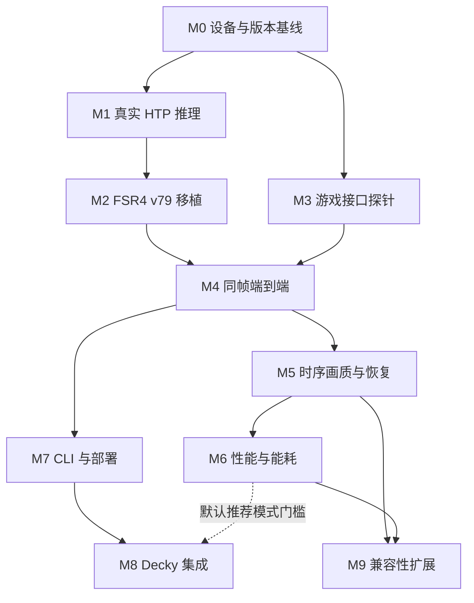

# 节点技术路线

> 当前选批入口：[设备接入后的 D01–D35 执行队列](DEVICE_EXECUTION.md)。无设备工作及已完成的 H/P 历史见 [HOST_PREPARATION](HOST_PREPARATION.md)。M0–M9 是技术参考和最终 gate，不是可整体领取的活动批次。

[项目首页](../../README.md) · [当前进度](../STATUS.md) · [D 执行队列](DEVICE_EXECUTION.md) · [轻量流程](../ai/MULTI_AGENT_WORKFLOW.md) · [公共合同](../architecture/CONTRACTS.md) · [历史研究](../reference/README.md)

当前没有连接 Odin 3，也没有选定并验证首个游戏。M0 只有主机侧工具证据，设备部分仍 `not_run`；M1–M9 的真实设备/游戏 gate 均 `not_run`。D 批次的实时状态统一由 STATUS 维护；“需目标设备”是执行条件，缺少设备本身不等于 `blocked`。

## 里程碑依赖图

M0 的平台资料足够时即可开展 M1，不必因尚未选定游戏而停止独立 NPU 诊断。M3 的游戏探针依赖实际游戏/ABI 基线。没有设备时可以做主机侧准备，但依赖硬件证据的门槛仍未通过。

## 十个技术节点与 D 批次映射

| 节点 | 技术路线 | 活动 D 批次 | 核心 gate |
| --- | --- | --- | --- |
| M0 | [设备与运行栈基线](M0-device-baseline.md) | D01–D05 | 真实 Linux/POSIX 行为和未修改设备基线 |
| M1 | [Linux QNN / HTP 平台验证](M1-npu-platform.md) | D06–D11 | 真实库/ABI/FastRPC 安全域、已知小图 HTP 和稳定性 |
| M2 | [FSR4 模型与 GPU 流水移植](M2-fsr4-port.md) | D12–D18 | 完整模型、真实 tensor、GPU 前后处理和 history/序列 |
| M3 | [游戏接口探针](M3-game-probe.md) | D19–D22 | 真实 NGX Evaluate、资源语义和正确回写 |
| M4 | [同帧端到端链路](M4-end-to-end.md) | D23–D27 | 跨进程协议、同帧身份、消费确认与 timeout 隔离 |
| M5 | [时序画质与恢复](M5-temporal-quality.md) | D28–D29 | 动态场景画质、history 恢复和长时稳定 |
| M6 | [性能、延迟与能耗](M6-performance.md) | D30–D31 | 分阶段 trace、fresh frame、热稳态 A/B 与能效 |
| M7 | [启动器与可回滚部署](M7-launcher-packaging.md) | D32–D33 | 事务恢复和真实用户级启动链 |
| M8 | [Steam / Decky 管理界面](M8-decky-integration.md) | D34 | 真实宿主、手柄操作、状态真实性和 CLI 恢复 |
| M9 | [游戏与 API 兼容性扩展](M9-compatibility.md) | D35（MVP 后可选） | 一个同 API 新游戏的独立全链复验 |

## 每份指南如何使用

先从 [DEVICE_EXECUTION](DEVICE_EXECUTION.md) 选择一个 D 批次，再只阅读对应 M 文档的技术内容。M 文档中的旧分批标题、建议目录、示例命令和 schema 是设计参考；“拟议”内容仍须实现后才能运行，但不构成第二套队列，也不要重复开工一个完整 M 节点。

共享语义以[合同草案](../architecture/CONTRACTS.md)和后续 ADR 为依据。具体实现改变了合同，需同步相关节点、测试和消费者；不能让各节点独自定义一个同名但含义不同的 `frame_id`、状态值或模型档。

每个 D 批次只更新自身状态和证据；只有该节点全部必要 D 批及对应 device/game gate 均通过，才更新 M 节点。真实设备与游戏证据当前全部 `not_run`。

## 批次记录

每批使用一份短记录，包含目标、基准/diff、实际环境与后端、命令/退出码、结果、device/game gate、缺项、审阅和下一步。模板可按需复用，但不再强制同时生成 work-card、验证报告、review packet 和 handoff。只有影响公共 ABI、同步、许可或架构的决定才需要 ADR；状态由集成者集中更新。

最早的完整技术依据保留在[2026-09-20 研究归档](../reference/README.md)。其中对上游的描述有固定日期/提交边界；新发现写入当前报告，不静默修改归档结论。
