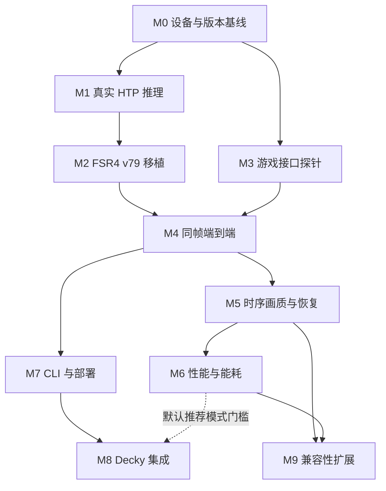

# 节点技术路线

> 按需参考：当前只推进 [STATUS 的 Windows/CPU 队列](../STATUS.md)。本目录保留完整设备路线，旧提示中的强制工作卡、多报告、设备执行步骤不用于当前阶段；日常以[轻量流程](../ai/MULTI_AGENT_WORKFLOW.md)为准。

[项目首页](../../README.md) · [当前进度](../STATUS.md) · [AI 接续指南](../ai/IMPLEMENTATION_GUIDE.md) · [公共合同](../architecture/CONTRACTS.md) · [历史研究](../reference/README.md)

这些页面主要是供后续开发者和 AI 实施的技术计划，不等于当前运行能力；实时进度以[项目状态](../STATUS.md)及其验证报告为准。M0 主机侧建档工具已经实现并通过现有主机回归，目标设备验收仍未运行；M1–M9 的运行时实现尚未开始。详细指南以中文编写；公共首页和初始研究保留中英文。

## 推荐推进顺序

M0 的平台资料足够时即可开展 M1，不必因尚未选定游戏而停止独立 NPU 诊断。M3 的游戏探针依赖实际游戏/ABI 基线。没有设备时可以做主机侧准备，但依赖硬件证据的门槛仍未通过。

## 十个节点

| 节点 | 技术路线 | 依赖 | 核心交付与验收 |
| --- | --- | --- | --- |
| M0 | [设备与运行栈基线](M0-device-baseline.md) | 无 | 可追溯设备记录、版本/ABI、缺项与无修改基线；明确游戏选择条件 |
| M1 | [Linux QNN / HTP 平台验证](M1-npu-platform.md) | M0 平台记录 | 已知小图真实 HTP 执行、输出核对、错误定位和生命周期记录 |
| M2 | [FSR4 模型与 GPU 流水移植](M2-fsr4-port.md) | M1；离线准备可提前 | v79 context 与完整模型/shader 清单，阶段输出与序列重放 |
| M3 | [游戏接口探针](M3-game-probe.md) | M0 及候选游戏/ABI | 真实 NGX 入口、纹理/参数语义、正确输出资源写回 |
| M4 | [同帧端到端链路](M4-end-to-end.md) | M2 + M3 | 版本化桥接、真实 NPU 输出返回对应游戏帧、可控失败 |
| M5 | [时序画质与恢复](M5-temporal-quality.md) | M4 | 显式 reset、历史隔离、动态场景与断连/恢复证据 |
| M6 | [性能、延迟与能耗](M6-performance.md) | M5 | 完整成本、真实新帧、交互延迟、热稳态 A/B、优化取舍 |
| M7 | [启动器与可回滚部署](M7-launcher-packaging.md) | M4；工程准备可提前 | 用户服务、CLI、配置、部署事务、退出/卸载/冲突恢复 |
| M8 | [Steam / Decky 管理界面](M8-decky-integration.md) | M7；推荐默认需 M6 | 面向实际宿主的控制客户端、按游戏操作、真实状态和 CLI 回退 |
| M9 | [游戏与 API 兼容性扩展](M9-compatibility.md) | M5 + M6 | 每种新增组合独立报告，按需扩展 OptiScaler/D3D12/Vulkan/FSR API |

## 每份指南如何使用

先检查入口条件，再选择一个工作包。指南包含模块建议、分批步骤、输入/输出合同、错误路径、主机/设备/游戏测试、验收清单和可复制的 AI 提示词。目录、命令和 schema 中标注“拟议”的内容必须先实现，不是可直接运行的工具。

共享语义以[合同草案](../architecture/CONTRACTS.md)和后续 ADR 为依据。具体实现改变了合同，需同步相关节点、测试和消费者；不能让各节点独自定义一个同名但含义不同的 `frame_id`、状态值或模型档。

建议每批控制在一个可独立验证的行为：例如 provider 查询、一个固定 shape 的 graphExecute、帧包长度检查、一次部署/恢复事务。只有该节点全部必要检查有证据通过，才更新节点为完成。

## 接续时交付什么

- [验证报告](../templates/validation-report.md)：环境、命令、退出码、资产哈希、结果与缺项。
- [交接记录](../templates/handoff.md)：已实现/未实现、决策、失败假设和下一项工作。
- [ADR](../templates/adr.md)：影响公共接口、架构或分发的决定。
- [状态页](../STATUS.md)：节点代码进度与各层验证状态，不拿文档完成代替实现完成。

最早的完整技术依据保留在[2026-09-20 研究归档](../reference/README.md)。其中对上游的描述有固定日期/提交边界；新发现写入当前报告，不静默修改归档结论。
